# CelebrateIt

## Table of Contents

1. [Project Overview](#1-project-overview)

2. [User Experience (UX)](#2-user-experience-ux)

   - [2.1 Strategy](#21-strategy)
   - [2.2 Scope](#22-scope)
   - [2.3 System Architecture](#23-system-architecture)
   - [2.4 Skeleton](#24-skeleton)
   - [2.5 Surface](#25-surface)

3. [Features](#3-features)

   - [Implemented Features](#implemented-features)
   - [Potential Future Enhancements](#potential-future-enhancements)

4. [Technologies Used](#4-technologies-used)

   - [4.1 Backend](#41-backend)
   - [4.2 Frontend](#42-frontend)
   - [4.3 Deployment & Tools](#43-deployment--tools)

5. [Development & Project Planning](#5-development--project-planning)

   - [5.1 Agile methodology]()
   - [5.2 Backend Code Structure]()
   - [5.3 Frontend Component Structure]()

6. [Testing](#6-testing)

   - [6.1 Back-End Application Testing](#61-back-end-application-testing)
   - [6.2 Front-End Application Testing](#62-front-end-application-testing)
   - [6.3 Validators](#63-validators)
   - [6.3 Bugs and Fixes](#63-bugs-and-fixes)

7. [Deployment](#7-deployment)

   - [7.1 Backend Deployment](#71-backend-deployment-initial-phase)
   - [7.2 Frontend Deployment](#72-frontend-deployment-static-build-integration)
   - [7.3 Forking and Cloning](#73-forking-and-cloning)

8. [Credits](#8-credit)
   - [Content & Resources](#content--resources)
   - [Acknowledgements](#acknowledgements)

---

## 1. Project Overview

### Brief Description

[CelebrateIt](https://celebrateit-866641373084.herokuapp.com/) is a mock employee recognition platform inspired by the solutions offered by [Workhuman](https://www.workhuman.com). It allows employees to share recognition stories, nominate colleagues for their achievements, and engage with content through likes and comments. By fostering a sense of appreciation and collaboration, CelebrateIt mirrors the functionality and purpose of modern social recognition platforms.

The project was built with the goal of designing a full-stack, token-authenticated web application using Django REST (backend) and React (frontend). It serves as a learning and portfolio project to demonstrate key development skills, including CRUD operations, component-based design, RESTful API integration, and deployment to Heroku.

### Target Audience

CelebrateIt is designed for:

- **Employees**: To feel valued and connected by sharing their achievements and recognizing contributions from their colleagues.

- **HR Teams**: To track and analyze recognition trends, fostering a more engaged workforce while identifying top performers and recognizing outstanding contributions.

- **Team Leaders and Managers**: To build a positive team culture by facilitating recognition and appreciation among their team.

- **Companies**: That wish to improve employee satisfaction and retention by integrating a sense of community into their workplace culture.

---

## 2. User Experience (UX)

### 2.1 Strategy

To plan the project development, I adopted an Agile methodology centered on user experience. By using user stories grouped into EPICs, the project is broken down into smaller, manageable pieces, ensuring a structured and user-focused approach.

#### **EPIC – Getting Started & Joining the Platform**

| **ID**                                                          | **Theme**                | **User Story**                                                                       | **Prioritisation** |
| --------------------------------------------------------------- | ------------------------ | ------------------------------------------------------------------------------------ | ------------------ |
| [#1](https://github.com/SophieDufrane/PP5-celebrateit/issues/1) | Account Registration     | Users can create an account with basic credentials to join the CelebrateIt platform. | Must Have          |
| [#2](https://github.com/SophieDufrane/PP5-celebrateit/issues/2) | Login to Account         | Users can securely log into their account to access features.                        | Must Have          |
| [#4](https://github.com/SophieDufrane/PP5-celebrateit/issues/4) | Log out of Account       | Users can securely log out to protect their account.                                 | Must Have          |
| [#6](https://github.com/SophieDufrane/PP5-celebrateit/issues/6) | Conditional Menu Options | The menu adapts to login status, showing relevant options.                           | Should Have        |

---

#### **EPIC – Recognition & Nomination CRUD**

| **ID**                                                            | **Theme**               | **User Story**                                                         | **Prioritisation** |
| ----------------------------------------------------------------- | ----------------------- | ---------------------------------------------------------------------- | ------------------ |
| [#11](https://github.com/SophieDufrane/PP5-celebrateit/issues/11) | Create a Recognition    | Users can submit a recognition story to celebrate someone.             | Must Have          |
| [#13](https://github.com/SophieDufrane/PP5-celebrateit/issues/13) | Edit Recognition        | Users can edit a previously shared recognition.                        | Must Have          |
| [#14](https://github.com/SophieDufrane/PP5-celebrateit/issues/14) | Delete Recognition      | Users can delete their recognition story.                              | Must Have          |
| [#15](https://github.com/SophieDufrane/PP5-celebrateit/issues/15) | View Recognition Detail | Users can view the full content of a recognition story.                | Should Have        |
| [#28](https://github.com/SophieDufrane/PP5-celebrateit/issues/28) | View Recognition Feed   | Users can browse all recognitions in the feed.                         | Must Have          |
| [#27](https://github.com/SophieDufrane/PP5-celebrateit/issues/27) | Create a Nomination     | Users can nominate a colleague for recognition using tags.             | Must Have          |
| [#29](https://github.com/SophieDufrane/PP5-celebrateit/issues/29) | Edit Nomination         | Users can update nomination content and tags.                          | Must Have          |
| [#30](https://github.com/SophieDufrane/PP5-celebrateit/issues/30) | Delete Nomination       | Users can remove a nomination they previously made.                    | Must Have          |
| [#31](https://github.com/SophieDufrane/PP5-celebrateit/issues/31) | View Nomination Detail  | Users can view full details of a nomination.                           | Should Have        |
| [#32](https://github.com/SophieDufrane/PP5-celebrateit/issues/32) | View Nomination Feed    | Users can browse all nominations in the feed.                          | Must Have          |
| [#12](https://github.com/SophieDufrane/PP5-celebrateit/issues/12) | View Own Posts          | Users can view a list of recognitions and nominations they’ve created. | Could Have         |

---

#### **EPIC – Engaging with People & Posts**

| **ID**                                                            | **Theme**                | **User Story**                                            | **Prioritisation** |
| ----------------------------------------------------------------- | ------------------------ | --------------------------------------------------------- | ------------------ |
| [#16](https://github.com/SophieDufrane/PP5-celebrateit/issues/16) | Like a recognition       | Users can like a recognition to show appreciation.        | Should Have        |
| [#17](https://github.com/SophieDufrane/PP5-celebrateit/issues/17) | Comment on a recognition | Users can comment on recognitions to engage with content. | Must Have          |
| [#33](https://github.com/SophieDufrane/PP5-celebrateit/issues/33) | Edit/Delete Comments     | Users can edit or remove their own comments.              | Should Have        |
| [#8](https://github.com/SophieDufrane/PP5-celebrateit/issues/8)   | Search for Colleagues    | Users can search for other people by name.                | Should Have        |

---

#### **EPIC – Managing My Profile & Network**

| **ID**                                                            | **Theme**            | **User Story**                                                      | **Prioritisation** |
| ----------------------------------------------------------------- | -------------------- | ------------------------------------------------------------------- | ------------------ |
| [#22](https://github.com/SophieDufrane/PP5-celebrateit/issues/22) | Edit My Profile      | Users can update their avatar and bio to personalise their profile. | Could Have         |
| [#21](https://github.com/SophieDufrane/PP5-celebrateit/issues/21) | View Public Profiles | Users can view other users’ bios and shared posts.                  | Must Have          |

---

#### UX Design Principles

User experience was prioritized by keeping the interface clean, predictable, and intuitive. The dual-feed layout, clear form feedback, dropdown menus, and use of color were guided by accessibility and usability best practices. The decision to split recognitions and nominations into distinct components also stems from a UX-first mindset: each content type needed to be readable, skimmable, and visually distinct.

### 2.2 Scope

All features listed above are prioritised using the **MoSCoW Framework** to guide development focus and ensure a successful MVP.

The current breakdown is:

- **Must Have** (13 / 21 → 62%): Core functionality required for project success.

- **Should Have** (6 / 21 → 28%): Enhancements that improve usability and experience.

- **Could Have** (2 / 21 → 10%): Nice-to-have features if time allows.

- **Won’t Have**: Explicitly removed from scope.

This distribution ensures alignment with project constraints and focus, while still allowing space for polish and stretch goals where appropriate.

#### Entity Relationship Diagram (ERD)

The ERD provides a high-level overview of the database structure, including the relationships between key models such as users, profiles, recognitions, nominations, tags, comments, and likes. It was designed early in the planning phase to ensure consistent field usage and API compatibility.


#### Flowchart for User Navigation

This section provides a visual representation of the user navigation flow within CelebrateIt. The flowchart captures how users interact with the platform, including key actions such as logging in, browsing stories, creating recognition posts, and navigating between profile pages.


### 2.3 System Architecture

CelebrateIt follows a decoupled architecture, separating the backend and frontend into two distinct layers:

- **Backend**: Built with Django REST Framework (DRF), the backend exposes a RESTful API. It handles authentication, user profiles, nominations, recognitions, comments, likes, tag/category and department logic. The API returns JSON responses that can be consumed by any client.
- **Frontend**: Developed using React, the frontend interacts with the API via `axios`. It handles routing with React Router, manages state locally (with hooks), and presents a dynamic interface to the user.
- **Data Flow**: React fetches data from DRF endpoints and displays it based on the user's interactions. Forms (e.g. create/edit nomination) submit data back to the API to update the database.
- **Authentication**: User sessions and permissions are managed via Django Allauth and token-based headers on the frontend.
- **Media and Hosting**:
  - User-uploaded images are stored on **Cloudinary**
  - Both frontend and backend are deployed via **Heroku** using a single monorepo setup, ensuring a unified deployment pipeline and simplified maintenance.

This architecture supports scalability and flexibility.

### 2.4 Skeleton

#### Wireframes & Final Page Layouts

The following wireframes outline the structure and layout of the main screens in CelebrateIt:

<details>
   <summary>Authentification Form</summary>

   <p>
      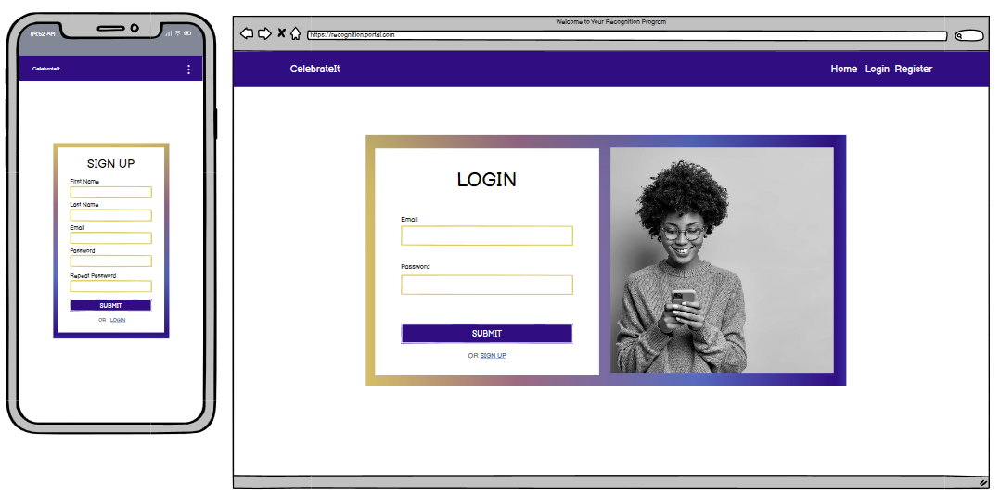
   </p>
</details>

<details>
   <summary>Home Feed Page</summary>

   <p>
      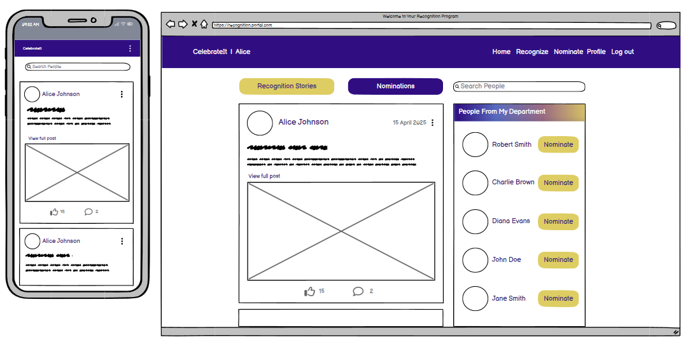
   </p>
</details>

<details>
   <summary>Recognition / Nomination Detail Page</summary>

   <p>
      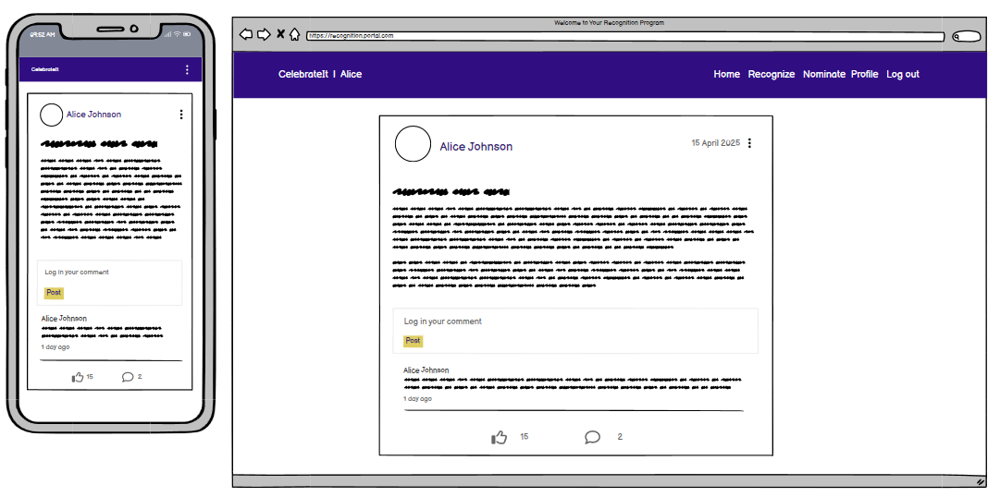
   </p>
</details>

<details>
   <summary>User Profile Page</summary>

   <p>
      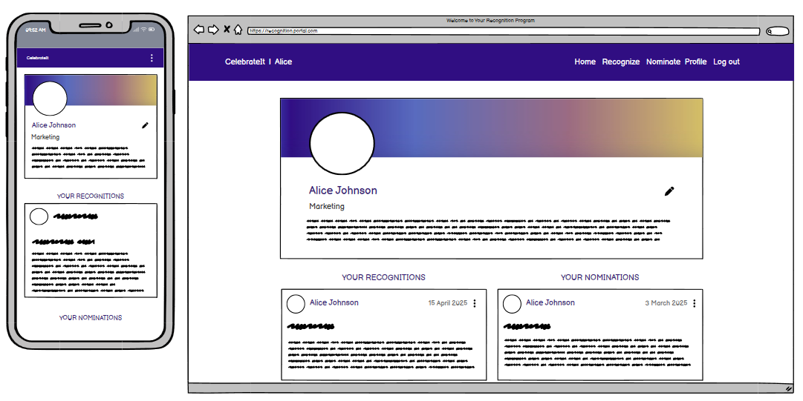
   </p>
</details>

#### Final UI Screenshots

Below are the final implementations of the main pages, which evolved from the original wireframes.

<details>
   <summary>Register a new account</summary>

   <p>
      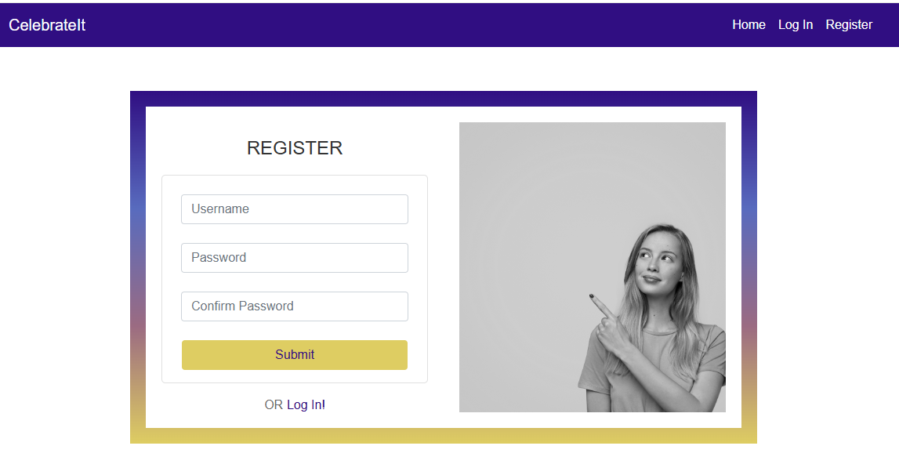
   </p>
</details>

<details>
   <summary>Log in to an existing Account</summary>

   <p>
      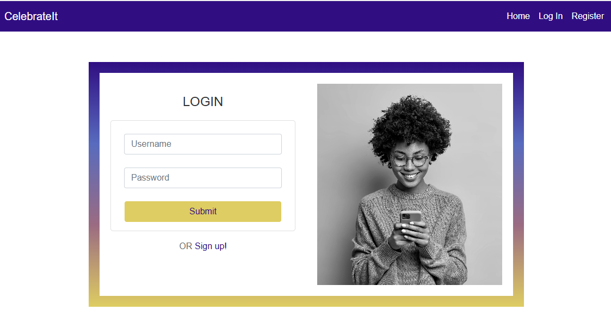
   </p>
</details>

<details>
   <summary>Home Feed Page</summary>

   <p>
      
   </p>
</details>

<details>
   <summary>Create Recognition Form</summary>

   <p>
      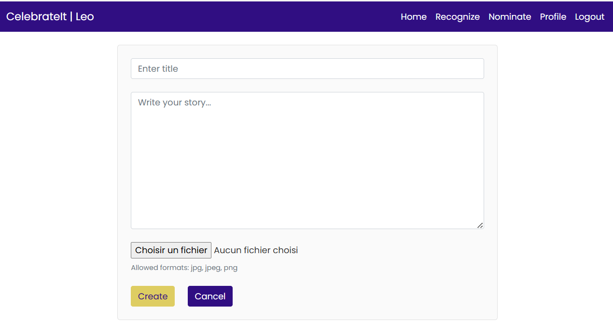
   </p>
</details>

<details>
   <summary>Create Nomination Form</summary>

   <p>
      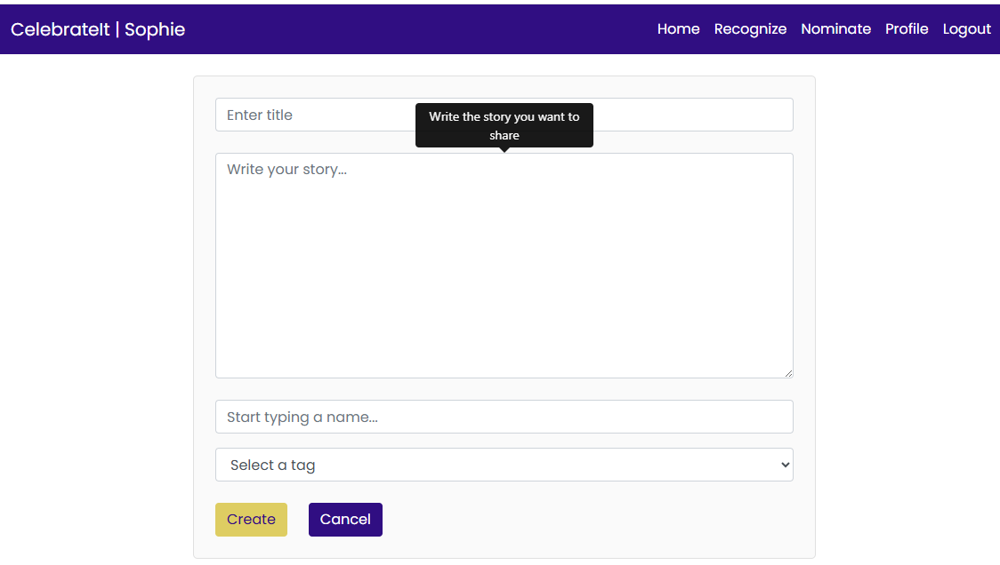
   </p>
</details>

<details>
   <summary>Recognition Detail Page</summary>

   <p>
      
   </p>
</details>

<details>
   <summary>Nomination Detail Page</summary>

   <p>
      
   </p>
</details>

<details>
   <summary>User Profile Page</summary>

   <p>
      
   </p>
</details>

<details>
   <summary>Edit User Profile Form</summary>

   <p>
      
   </p>
</details>

### 2.5 Surface

#### Typography & Colour Scheme

CelebrateIt builds on the visual identity of the previous Rewards Platform (PP4 - RedeemIt), maintaining a clean, user-friendly interface with a more social and collaborative tone.

The colour palette echoes tech industry trends while adding warmth to reflect human connection in the workplace. Fonts were chosen for readability and a modern feel.

#### Colour Palette

| **Colour** | **Name**         |
| ---------- | ---------------- |
| `#300E82`  | Persian Indigo   |
| `#586BBE`  | Savoy Blue       |
| `#9B6B82`  | Mountbatten Pink |
| `#DECD62`  | Citron           |
| `#484848`  | Davy's Grey      |


<details>
  <summary>Inspiration from Workhuman</summary>

   <p>
      
   </p>
</details>

### Typography

- **Primary Font**: _Poppins_ – main body text
- **Secondary Font**: _Quicksand_ – used for highlights and UI accents

---

## 3. Features

### Implemented Features

- Secure user registration and login via Django Allauth
- Conditional navigation menu that adapts to auth state
- Create, edit, delete, and view **Recognition** stories
- Create, edit, delete, and view **Nominations** with required tags
- Combined feed with toggle to switch between Recognition and Nominations
- Detail pages for each recognition and nomination
- Real-time **like** system for recognitions
- **Comment** system with edit and delete options for authors
- Public profile pages showing user's info and contributions
- Logged-in users can **edit their avatar and bio**
- **Search bar** to find colleagues from the feed by name

### Potential Future Enhancements

- **Comment and Like Functionality on Nominations**  
  Extend the interactive features available on recognition posts to nominations, allowing users to express appreciation or share supportive comments on nomination cards.

- **Quick Nomination Button from People Sidebar**  
  Allow users to click a “Nominate” button directly next to a coworker’s name in the sidebar search results, pre-filling the nominee field on the nomination form.

- **Tag-Based Visual Filters**  
  Replace the current tag dropdown with a horizontal tag bar featuring colored badges/icons for each tag. Clicking a tag would visually filter the nominations feed by category (e.g., Innovation, Leadership, Teamwork).

- **Department-Based Feed Filters**  
  Introduce a filter system to view recognitions and nominations by department, helping teams focus on their own group’s stories and achievements.

- **Saved Filters or Personal Feed Preferences**  
  Allow users to set preferred filters (e.g., tags, people, or departments) that persist between sessions for a more personalized experience.

- **Admin Dashboard (HR/Team Leads)**  
  A potential admin-level view to analyze engagement, tag frequency, or most recognized employees for internal reporting or performance reviews.

---

## 4. Technologies Used

### 4.1. Backend

The backend API was developed using Django and the Django REST Framework:

- **Django** – Python-based web framework for rapid development and clean architecture.
- **Django REST Framework** – Used to build RESTful APIs consumed by the frontend.
- **Django Allauth** – Manages user registration, login, logout, and authentication endpoints.
- **PostgreSQL** – Relational database hosted on Heroku via automatic provisioning.
- **Cloudinary** – Handles media uploads and delivery, especially for user-submitted images.

### 4.2 Frontend

The frontend of CelebrateIt was built using the following technologies:

- **React** – Core library for building user interfaces with reusable components.
- **React Router DOM** – Enables dynamic client-side routing and navigation.
- **Axios** – Handles HTTP requests to the Django REST API.
- **Bootstrap** – Provides a responsive layout foundation and base UI components.
- **CSS Modules** – Used for scoped styling of components and to prevent class name collisions.

#### React Hooks & Architecture

CelebrateIt relies heavily on React functional components with hooks for local state and side effects. `useState` manages form inputs, toggle states, and like/comment data. `useEffect` is used for fetching API data and syncing profile updates. The component structure emphasizes separation of concerns: shared layout (`PostLayoutShell`), interaction elements (`PostForm`), and containers provide clarity and reusability across the app.

### 4.3 Deployment & Tools

- **Heroku** – Hosting and deployment of the Django REST API backend.
- **GitHub** – Version control and repository management.
- **GitHub Pages** _(optional)_ – Considered for frontend deployment (not used in final setup).
- **Git** – Local version control with atomic commits and branching.
- **VS Code** – Primary code editor with integrated terminal and extensions for React/Django.
- **Browser-based API testing** – API endpoints were tested directly via browser during development using Django’s built-in dev server.
- **Chrome DevTools & Lighthouse** – Used for inspecting layout, debugging responsiveness, and running accessibility/performance audits.

---

## 5. Development & Project Planning

### 5.1 Agile methodology

A **Kanban-style** board was implemented using **GitHub Projects** to visually manage tasks, organize development phases, and track progress through user stories and acceptance criteria.

<details>
  <summary>Kaban Board</summary>

   <p>
      
   </p>
</details>

<details>
  <summary>User Story with Acceptance Criteria and tasks</summary>

   <p>
      User Story detail" />
   </p>
</details>

### 5.2 Backend Code Structure

The backend is organised into feature-based Django apps:

- `posts/` – Recognition stories with optional image
- `nominations/` – Peer nominations with required tag and nominee selection
- `profiles/` – User profile extensions with department
- `likes/` and `comments/` – Interactions for recognition stories
- `tags/` – Used to categorize nominations
- `department/` – Departments available for user filtering and classification

Each app follows the same structure: `models.py`, `serializers.py`, `views.py`, and `urls.py`. Common permissions are stored in the main `celebrateit_api/permissions.py`.

### 5.3 Frontend Component Structure

#### Refactoring & Naming Decisions

- **Backend Naming: Recognition vs. Nomination**

At the beginning of development, the term **“post”** was used in the backend to represent a **recognition** entry. This naming choice made sense during the early phases, especially given the social-media style feed, but as the project grew to include **nominations** as a distinct content type, this naming led to confusion.

In hindsight:

- The model representing a recognition story should have been named `Recognition` instead of `Post`.
- The use of `post` throughout serializers, views, and URLs became semantically ambiguous once nominations were introduced.
- This naming limitation was preserved to avoid heavy refactoring and potential migration issues close to the project deadline.

Despite the naming mismatch, internal consistency was maintained, and the API functionality remained clear and testable.

- **Frontend Refactor: From Shared Logic to Dedicated Components**

The frontend originally aimed to reuse as many components as possible by treating both **recognitions** and **nominations** under a shared structure. However, the visual and behavioral differences between these two types gradually made this strategy unsustainable.

#### Key Challenges:

- **Component Naming Confusion**: Because recognitions were tied to the `Post` model, the frontend component that handled recognitions was also named `Post`. Meanwhile, a generic shared component also used the name `Post`, leading to frequent confusion during development.
- **Layout Divergence**: Recognitions contain optional images, likes, and comments, while nominations include unique elements like nominee name and tag (with styling).
- **Conditional Logic Overload**: `PostCard` initially handled both types through conditional rendering, which became hard to maintain and error-prone.

#### Refactor Strategy & Results

To address these issues, a structured refactor was implemented:

| Component         | Purpose                                                                 |
| ----------------- | ----------------------------------------------------------------------- |
| `PostLayoutShell` | Shared structural wrapper for both types (title, content, header, etc.) |
| `PostHeader`      | Extracted component for avatar, name, timestamp, and dropdown menu      |
| `PostCard`        | Focused solely on recognitions, includes image, like/comment logic      |
| `NominationCard`  | Handles nominations; renders nominee + tag via `extraContent` prop      |

This refactor provided:

- Clear separation of concerns between recognitions and nominations
- Better maintainability and scalability for future features
- Improved readability of both JSX and CSS modules

#### Component Tree

```

Navbar (component)
├── NavLinks (Home, Recognise, Nominate, Profile, Logout)

HomeFeedPage (container)
├── FeedSection
│     ├── FeedToggleButtons
│     ├── FeedList
│     │     ├── RecognitionCard → PostLayoutShell
│     │     └── NominationCard → PostLayoutShell
├── PeopleSidebar
│     ├── SearchField
│     └── PeopleList

PostLayoutShell
├── PostHeader (shared header)
│     ├── Avatar placeholder
│     ├── Display name
│     └── Created at + Dropdown
├── metaTop (optional – nominee + tag)
├── Title
├── Content
├── extraContent (optional – e.g. 'View full post' or tag block)
└── children (optional – image, comments, etc.)

RecognitionDetailPage (container)
├── PostLayoutShell
│     └── children
│           ├── PostImage (optional)
│           ├── CommentForm
│           └── CommentList
├── ConfirmDeleteModal

NominationDetailPage (container)
├── PostLayoutShell
│     └── metaTop (nominee info + tag badge)
├── ConfirmDeleteModal

CreateRecognitionPage / UpdateRecognitionPage (container)
└── PostForm
      └── Image upload (optional)

CreateNominationPage / UpdateNominationPage (container)
└── NominationForm
      ├── Nominee selector
      └── Tag field

ProfilePage (container)
├── Profile Header
|     ├── Profile Image
|     ├── Username (First and Last name)
|     ├── Department
|     └── Bio / Presentation text
├── ProfileFeedSection (container)

```

---

## 6. Testing

### 6.1 Back-End Application Testing

The following tests were conducted manually to verify the functionality, permissions, and expected behavior of the back-end API endpoints. All tests were performed using the Django REST Framework browsable API interface through the browser.

Each section below corresponds to a model and includes the tested endpoint, HTTP method, required authentication, expected behavior, actual results, and screenshots where relevant.

#### **User Profiles**

| Endpoint                           | Action                     | Method | Auth | Expected                                         | Actual | Screenshot |
| ---------------------------------- | -------------------------- | ------ | ---- | ------------------------------------------------ | ------ | ---------- |
| `/user-profiles/`                  | List all user profiles     | GET    | ❌   | HTTP 200 OK                                      | ✅     | 1          |
| `/user-profiles/10/`               | View profile detail        | GET    | ❌   | HTTP 200 OK                                      | ✅     | 2          |
| `/user-profiles/9/`                | Update profile (owner)     | PUT    | ✅   | HTTP 200 OK / Profile updated                    | ✅     | 3          |
| `/user-profiles/10/`               | Update profile (not owner) | PUT    | ✅   | HTTP 403 Forbidden / Profile should be read-only | ✅     | 4          |
| `/user-profiles/?department=SALES` | Filter by department       | GET    | ❌   | HTTP 200 OK / Only SALES users                   | ✅     | 5          |
| `/user-profiles/?search=raymond`   | Search by name             | GET    | ❌   | HTTP 200 OK / Only Profiles with \"raymond\"     | ✅     | 6          |

<details>
<summary> 1/ List all user profiles </summary>

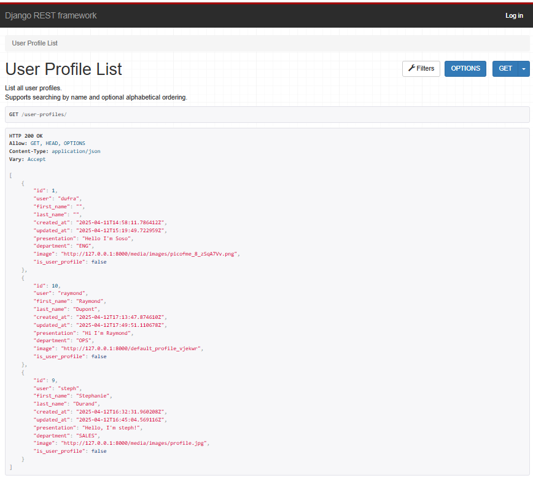

</details>

<details>
<summary> 2/ View profile detail </summary>


</details>

<details>
<summary> 3/ Update profile (owner) </summary>


</details>

<details>
<summary> 4/ Update profile (not owner) </summary>


</details>

<details>
<summary> 5/ Filter by department </summary>


</details>

<details>
<summary> 6/ Search by name </summary>


</details>

#### **Posts**

| Endpoint                   | Action                    | Method | Auth | Expected                                                  | Actual | Screenshot |
| -------------------------- | ------------------------- | ------ | ---- | --------------------------------------------------------- | ------ | ---------- |
| `/posts/`                  | List all the posts        | GET    | ❌   | HTTP 200 OK                                               | ✅     | 1          |
| `/posts/4/`                | View a post detail        | GET    | ❌   | HTTP 200 OK                                               | ✅     | 2          |
| `/posts/`                  | Create a post             | POST   | ✅   | HTTP 201 Created                                          | ✅     | 3          |
| `/posts/5/`                | Update a post (owner)     | PUT    | ✅   | HTTP 200 OK / Post updated successfully                   | ✅     | 4          |
| `/posts/1/`                | Update a post (not owner) | GET    | ✅   | HTTP 403 Forbidden / Post should be read-only             | ✅     | 5          |
| `/posts/2/`                | Delete a post (owner)     | DELETE | ✅   | HTTP 204 No Content                                       | ✅     | 6          |
| `/posts/1/`                | Delete a post (not owner) | DELETE | ✅   | HTTP 403 Forbidden / Post should be read-only             | ✅     | 7          |
| `/posts/?search=raymond`   | Search by name            | GET    | ❌   | HTTP 200 OK / Only posts with \"raymond\"                 | ✅     | 8          |
| `/posts/?department=SALES` | Filter by department      | GET    | ❌   | HTTP 200 OK / Only posts from users in department "SALES" | ✅     | 9          |

<details>
<summary> 1/ List all the posts </summary>


</details>

<details>
<summary> 2/ View a post detail </summary>


</details>

<details>
<summary> 3/ Create a post </summary>

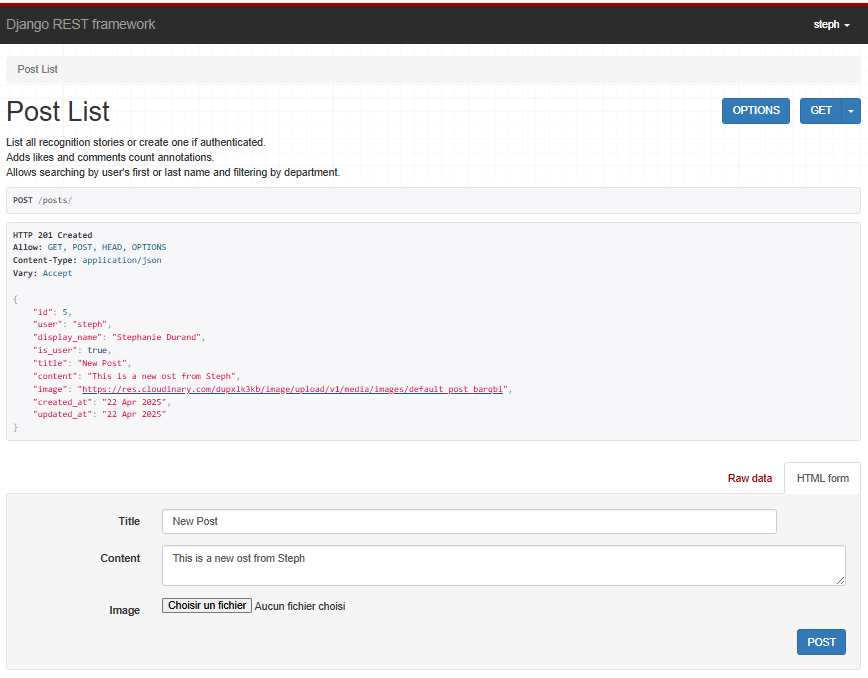

</details>

<details>
<summary> 4/ Update a post (owner) </summary>


</details>

<details>
<summary> 5/ Update a post (not owner) </summary>

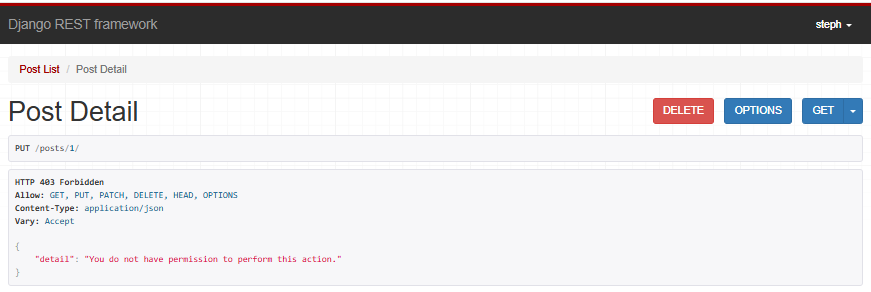

</details>

<details>
<summary> 6/ Delete a post (owner) </summary>

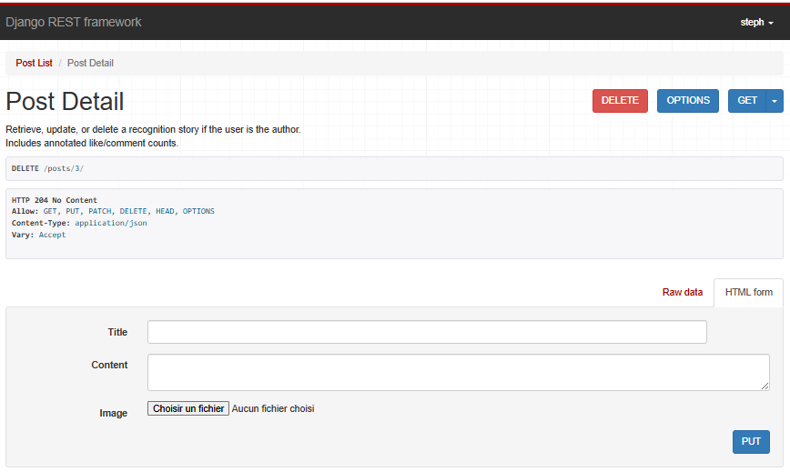

</details>

<details>
<summary> 7/ Delete a post (not owner) </summary>


</details>

<details>
<summary> 8/ Search by name </summary>

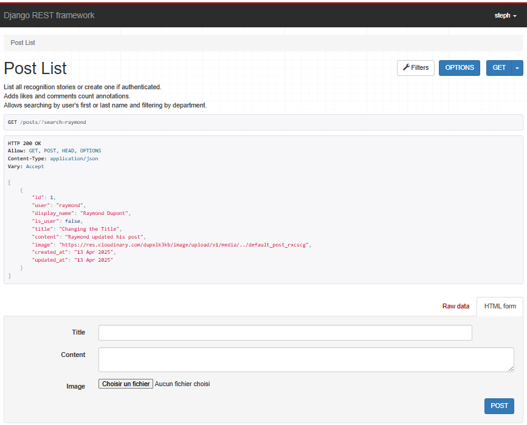

</details>

<details>
<summary> 9/ Search by department </summary>


</details>

#### **Nominations**

| Endpoint                                             | Action                           | Method | Auth | Expected                                                       | Actual | Screenshot |
| ---------------------------------------------------- | -------------------------------- | ------ | ---- | -------------------------------------------------------------- | ------ | ---------- |
| `/nominations/`                                      | List all the nominations         | GET    | ❌   | HTTP 200 OK                                                    | ✅     | 1          |
| `/nominations/1/`                                    | View a nomination detail         | GET    | ❌   | HTTP 200 OK                                                    | ✅     | 2          |
| `/nominations/`                                      | Create a nomination              | POST   | ✅   | HTTP 201 Created                                               | ✅     | 3          |
| `/nominations/7/`                                    | Update a nomination (owner)      | PUT    | ✅   | HTTP 200 OK / Nomination updated successfully                  | ✅     | 4          |
| `/nominations/1/`                                    | Update a nomination (not owner)  | GET    | ✅   | HTTP 403 Forbidden / Nomination should be read-only            | ✅     | 5          |
| `/nominations/7/`                                    | Delete a nomination (owner)      | DELETE | ✅   | HTTP 204 No Content                                            | ✅     | 6          |
| `/nominations/1/`                                    | Delete a nomination (not owner)  | DELETE | ✅   | HTTP 403 Forbidden / Nomination should be read-only            | ✅     | 7          |
| `/nominations/?search=raymond`                       | Search by nominee/nominator      | GET    | ❌   | HTTP 200 OK / Only nominations involving "raymond"             | ✅     | 8          |
| `/nominations/?nominator__profile__department=SALES` | Filter by department (nominator) | GET    | ❌   | HTTP 200 OK / Only nominations from "SALES" nominator profiles | ✅     | 9          |
| `/nominations/?tag=3`                                | Filter by tag                    | GET    | ❌   | HTTP 200 OK / Only nominations with "Innovation" tag (ID=3)    | ✅     | 10         |
| `/nominations/?nominee=2`                            | Filter by nominee                | GET    | ❌   | HTTP 200 OK / Only nominee "steph" (ID=2)                      | ✅     | 11         |

<details>
<summary> 1/ List all the nominations </summary>


</details>

<details>
<summary> 2/ View a nomination detail </summary>


</details>

<details>
<summary> 3/ Create a nomination </summary>


</details>

<details>
<summary> 4/ Update a nomination (owner) </summary>


</details>

<details>
<summary> 5/ Update a nomination (not owner) </summary>


</details>

<details>
<summary> 6/ Delete a nomination (owner) </summary>


</details>

<details>
<summary> 7/ Delete a nomination (not owner) </summary>

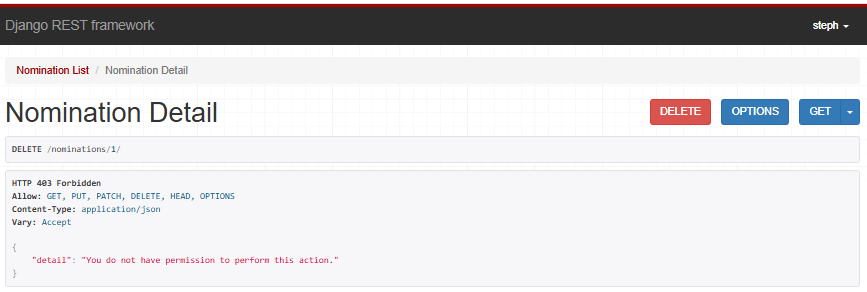

</details>

<details>
<summary> 8/ Search by nominee/nominator </summary>


</details>

<details>
<summary> 9/ Filter by department (nominator) </summary>

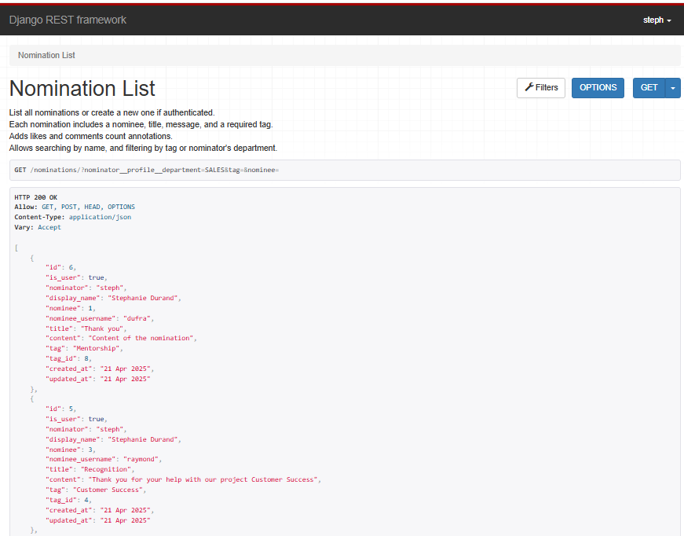

</details>

<details>
<summary> 10/ Filter by tag </summary>


</details>

<details>
<summary> 11/ Filter by nominee </summary>


</details>

#### **Comments**

| Endpoint                  | Action                              | Method | Auth | Expected                                    | Actual | Screenshot |
| ------------------------- | ----------------------------------- | ------ | ---- | ------------------------------------------- | ------ | ---------- |
| `/comments/`              | List all the comments               | GET    | ❌   | HTTP 200 OK                                 | ✅     | 1          |
| `/comments/`              | Create a comment on post/nomination | POST   | ✅   | HTTP 201 Created                            | ✅     | 2          |
| `/comments/4/`            | Update a comment (owner)            | PUT    | ✅   | HTTP 200 OK / Comment updated successfully  | ✅     | 3          |
| `/comments/4/`            | Delete a comment (owner)            | DELETE | ✅   | HTTP 204 No Content                         | ✅     | 4          |
| `/comments/?post=4`       | Filter by post                      | GET    | ❌   | HTTP 200 OK / Only comments on post 4       | ✅     | 5          |
| `/comments/?nomination=3` | Filter by nomination                | GET    | ❌   | HTTP 200 OK / Only comments on nomination 3 | ✅     | 6          |

<details>
<summary> 1/ List all the comments </summary>


</details>

<details>
<summary> 2/ Create a comment </summary>


</details>

<details>
<summary> 3/ Update a comment (owner) </summary>

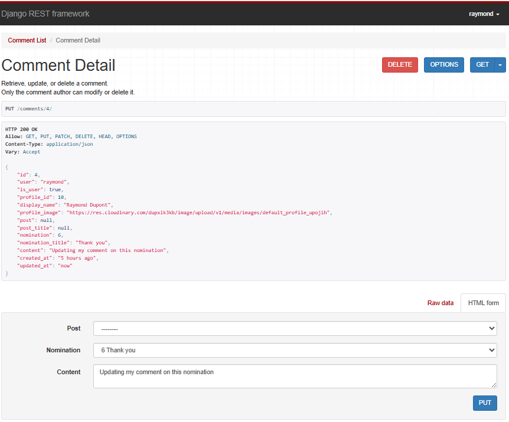

</details>

<details>
<summary> 4/ Delete a comment (owner) </summary>


</details>

<details>
<summary> 5/ Filter by post </summary>


</details>

<details>
<summary> 6/ Filter by nomination </summary>


</details>

#### **Likes**

| Endpoint    | Action                               | Method | Auth | Expected                               | Actual | Screenshot |
| ----------- | ------------------------------------ | ------ | ---- | -------------------------------------- | ------ | ---------- |
| `/likes/`   | Create a like on post/nomination     | POST   | ✅   | HTTP 201 Created                       | ✅     | 1          |
| `/likes/`   | Invalid: like both post & nomination | POST   | ✅   | HTTP 400 Bad Request / Can’t like both | ✅     | 2          |
| `/likes/`   | Invalid: like same thing twice       | POST   | ✅   | HTTP 400 Bad Request / Already liked   | ✅     | 3          |
| `/likes/5/` | Delete a like (owner)                | DELETE | ✅   | HTTP 204 No Content                    | ✅     | 4          |

<details>
<summary> 1/ Create a like on post/nomination </summary>

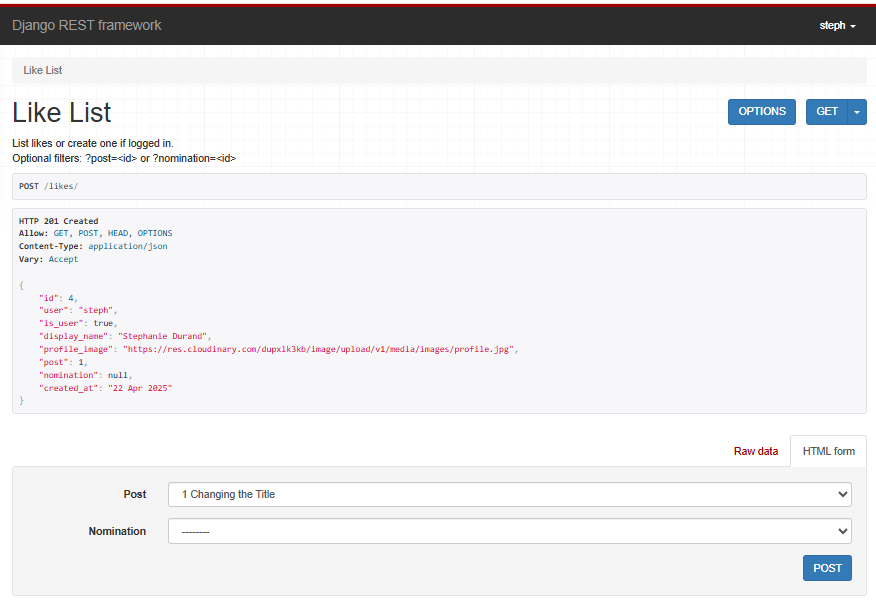

</details>

<details>
<summary> 2/ Invalid: like both post & nomination </summary>


</details>

<details>
<summary> 3/ Invalid: like same thing twice </summary>


</details>

<details>
<summary> 4/ Delete a like (owner) </summary>


</details>

#### **Departments (via Profiles, Posts, Nominations)**

| Endpoint                                           | Action                                      | Method | Auth | Expected                                                 | Actual | Screenshot |
| -------------------------------------------------- | ------------------------------------------- | ------ | ---- | -------------------------------------------------------- | ------ | ---------- |
| `/user-profiles/`                                  | List profiles with department field visible | GET    | ❌   | HTTP 200 OK / Department value shown per profile         | ✅     | 1          |
| `/user-profiles/10`                                | Profile detail with department field        | GET    | ❌   | HTTP 200 OK / Department is correct for the user         | ✅     | 2          |
| `/posts/?user__profile__department=OPS`            | Filter posts by user department             | GET    | ❌   | HTTP 200 OK / Only posts from users in Operation         | ✅     | 3          |
| `/nominations/?nominator__profile__department=OPS` | Filter nominations by nominator department  | GET    | ❌   | HTTP 200 OK / Only nominations from Operation nominators | ✅     | 4          |

<details>
<summary> 1/ List profiles with department field visible </summary>


</details>

<details>
<summary> 2/ Profile detail with department field </summary>

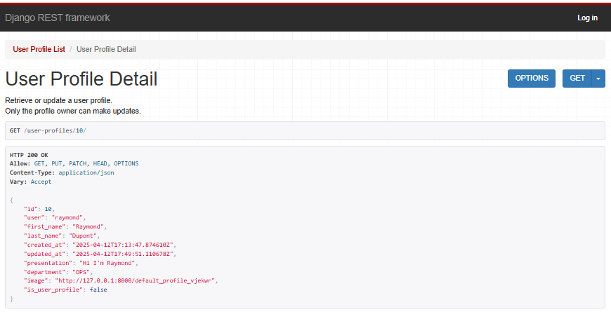

</details>

<details>
<summary> 3/ Filter posts by user department </summary>


</details>

<details>
<summary> 4/ Filter nominations by nominator department </summary>


</details>

#### **Tags**

| Endpoint               | Action                     | Method | Auth | Expected                                                  | Actual | Screenshot |
| ---------------------- | -------------------------- | ------ | ---- | --------------------------------------------------------- | ------ | ---------- |
| `/tags/`               | List all tags              | GET    | ❌   | HTTP 200 OK / All available tags listed                   | ✅     | 1          |
| `/nominations/`        | Create nomination with tag | POST   | ✅   | HTTP 201 Created / Nomination includes correct tag        | ✅     | 2          |
| `//nominations/?tag=3` | Filter nominations by tag  | GET    | ❌   | HTTP 200 OK / Only nominations with tag Innovation (ID=3) | ✅     | 3          |

<details>
<summary> 1/ List all tags </summary>


</details>

<details>
<summary> 2/ Create nomination with tag </summary>

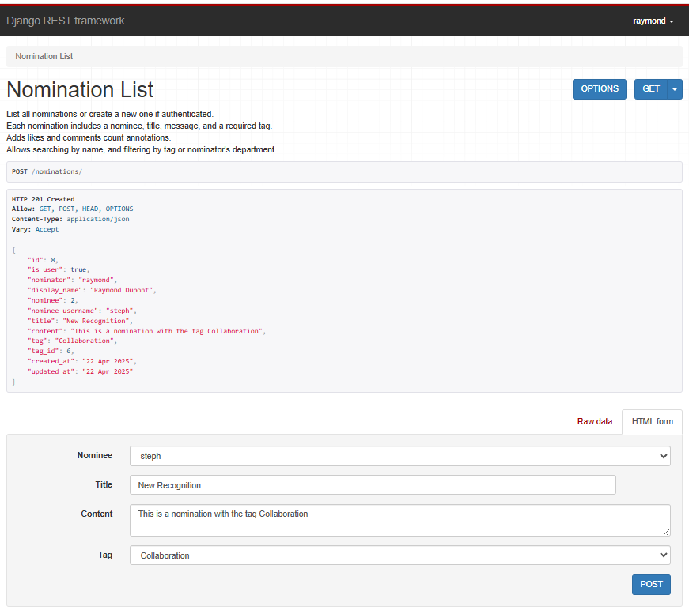

</details>

<details>
<summary> 3/ Filter nominations by tag </summary>

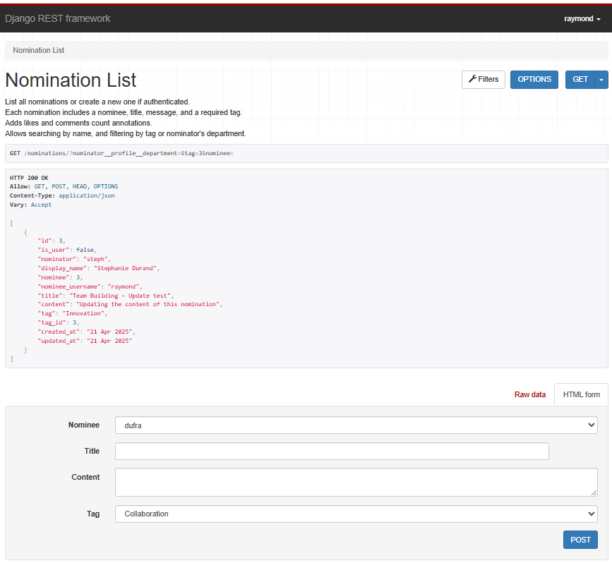

</details>

---

### 6.2 Front-End Application Testing

All manual testing was performed on the deployed frontend using a real user account. Each user story was tested with expected interactions and outcomes, covering both positive and negative cases.

Testing included:

- Auth flows (register, login, logout)
- Recognition and nomination CRUD
- Feed behaviour and toggling
- Detail page rendering
- Like and comment functionality
- User profile views and editing
- Search bar and sidebar interactions

#### **Getting Started & Joining the Platform**

| **Priority** | **User Story**           | **Page(s)**       | **Test Scenario / Action**                      | **Expected Result**                                                                | Actual | **Screenshot** |
| ------------ | ------------------------ | ----------------- | ----------------------------------------------- | ---------------------------------------------------------------------------------- | ------ | -------------- |
| Must Have    | Register an Account      | Register Page     | Fill out form with valid inputs and submit      | Redirected to login, message confirms successful registration                      | ✅     | 1 - 2          |
| Must Have    | Login to Account         | Login Page        | Enter valid credentials and submit              | Redirected to feed with user menu visible                                          | ✅     | 3              |
| Must Have    | Logout                   | Any Page (Navbar) | Click logout                                    | User is logged out and redirected to login, message confirms successful logged out | ✅     | 4              |
| Must Have    | Conditional Menu Options | All Pages         | Login and check navbar / Logout and check again | Menu adapts based on login status                                                  | ✅     | 5 - 6          |

<details>
<summary> 1/ Register – Validation Errors Display </summary>

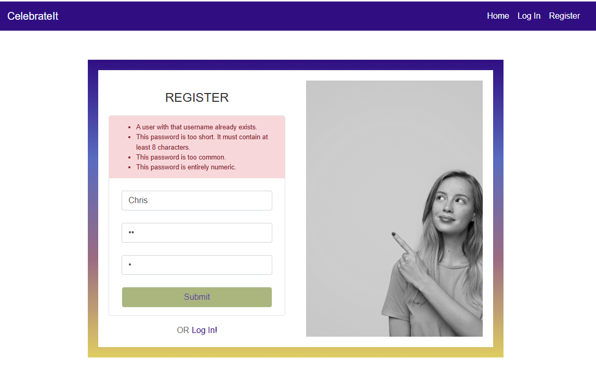

</details>

<details>
<summary> 2/ Register - Successful message </summary>


</details>

<details>
<summary> 3/ Log In - Validation Errors Display </summary>


</details>

<details>
<summary> 4/ Logged out - Successful message </summary>


</details>

<details>
<summary> 5/ Conditional Menu Options when logged out </summary>


</details>

<details>
<summary> 6/ Conditional Menu Options when logged in </summary>

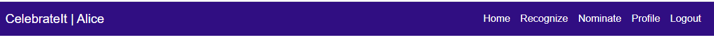

</details>

#### **Recognition CRUD**

| **Priority** | **User Story**          | **Page(s)**            | **Test Scenario / Action**            | **Expected Result**                                 | Actual | **Screenshot** |
| ------------ | ----------------------- | ---------------------- | ------------------------------------- | --------------------------------------------------- | ------ | -------------- |
| Must Have    | Create Recognition      | Post Create Page       | Fill out form with content and submit | Redirected to detail, new post shows in feed        | ✅     | 1              |
| Must Have    | Edit Recognition        | Feed > Edit Dropdown   | Change title or content and save      | Updated post appears in feed and detail             | ✅     | 2 - 3 - 4      |
| Must Have    | Delete Recognition      | Feed > Delete Dropdown | Click delete and confirm              | Post is removed from feed and not accessible by URL | ✅     | 5 - 6          |
| Must Have    | View Recognition Detail | Feed > Click Card      | Click post preview in feed            | Full post loads with correct data                   | ✅     |                |
| Must Have    | View Recognition Feed   | Homepage               | Open homepage                         | Feed shows latest recognitions, ordered by date     | ✅     |                |

<details>
<summary> 1/ Create Recognition – Successful message </summary>

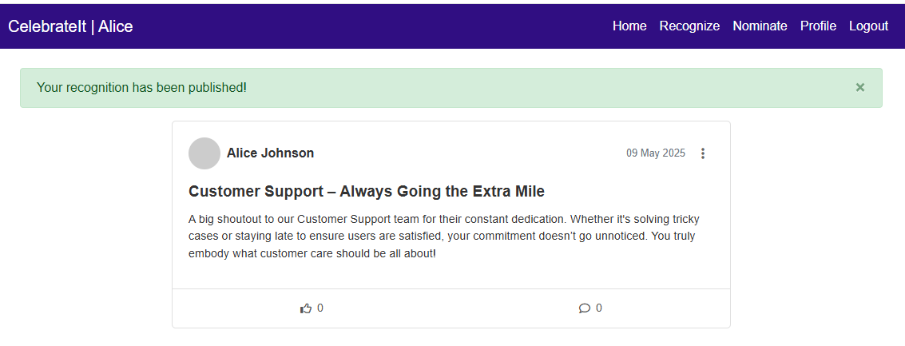

</details>

<details>
<summary> 2/ Edit Recognition – Dropdown feed </summary>


</details>

<details>
<summary> 3/ Edit Recognition – Form pre-filled </summary>


</details>

<details>
<summary> 4/ Edit Recognition – Successful message </summary>

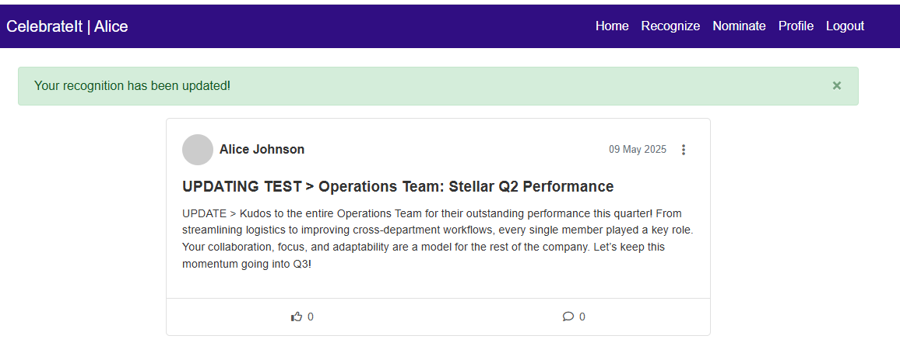

</details>

<details>
<summary> 5/ Delete Recognition - Confirmation prompt </summary>

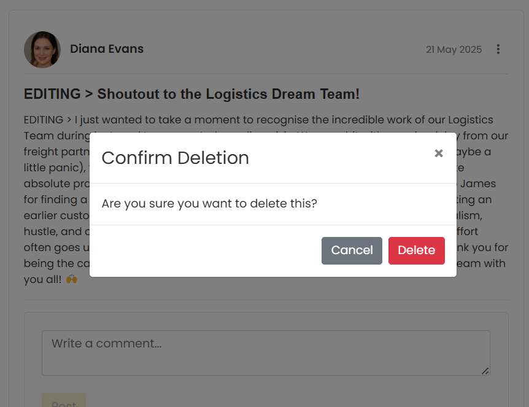

</details>

<details>
<summary> 6/ Delete Recognition > Successful message </summary>


</details>

#### **Nomination CRUD**

| **Priority** | **User Story**         | **Page(s)**            | **Test Scenario / Action**             | **Expected Result**                                 | Actual | **Screenshot** |
| ------------ | ---------------------- | ---------------------- | -------------------------------------- | --------------------------------------------------- | ------ | -------------- |
| Must Have    | Create Nomination      | Nomination Create Page | Submit valid form with nominee and tag | Redirect to detail, nomination shows in feed        | ✅     | 1 - 2 - 3 - 4  |
| Must Have    | Edit Nomination        | Feed > Edit Dropdown   | Update text or tags                    | Updated nomination shown in feed and detail         | ✅     | 5 - 6          |
| Must Have    | Delete Nomination      | Feed > Delete Dropdown | Delete a nomination and confirm        | Nomination disappears from feed and is inaccessible | ✅     | 7 - 8          |
| Must Have    | View Nomination Detail | Feed > Click Card      | Click on nomination preview            | Full nomination loads with correct data             | ✅     |                |
| Must Have    | View Nomination Feed   | Toggle in Homepage     | Use toggle to switch feed type         | Feed updates to show only nominations               | ✅     |                |

<details>
<summary> 1/ Create Nomination – Successful message </summary>

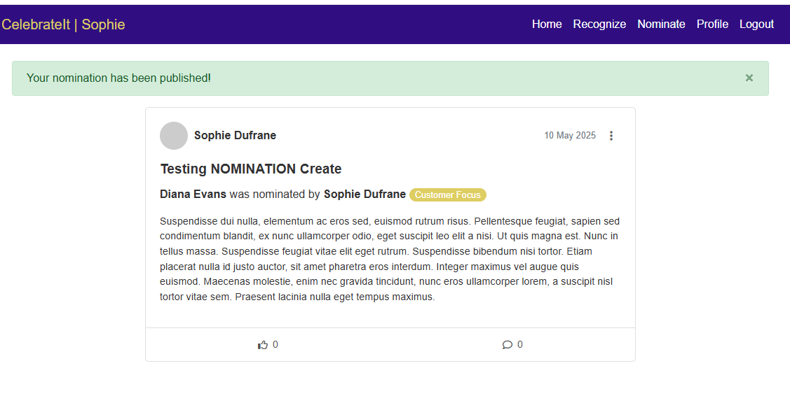

</details>

<details>
<summary> 2/ Create Nomination – tag dropdwon </summary>

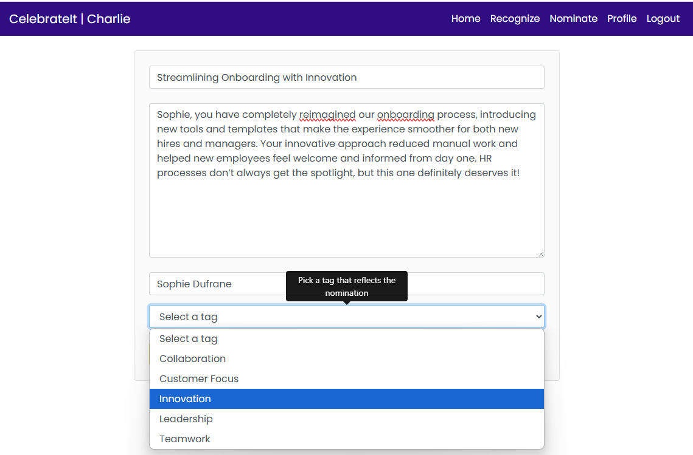

</details>

<details>
<summary> 3/ Create Nomination – search people by name </summary>

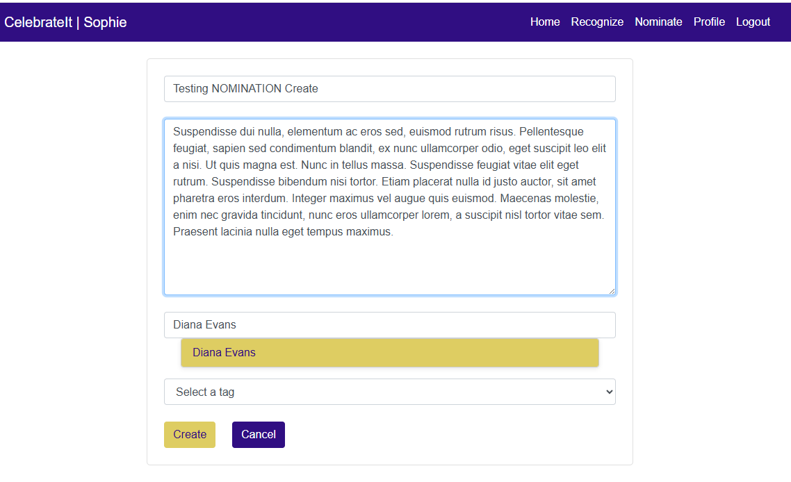

</details>

<details>
<summary> 4/ Create Nomination – tag mandatory </summary>

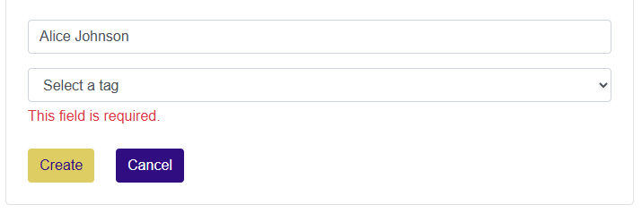

</details>

<details>
<summary> 5/ Edit Nomination – Dropdown feed </summary>

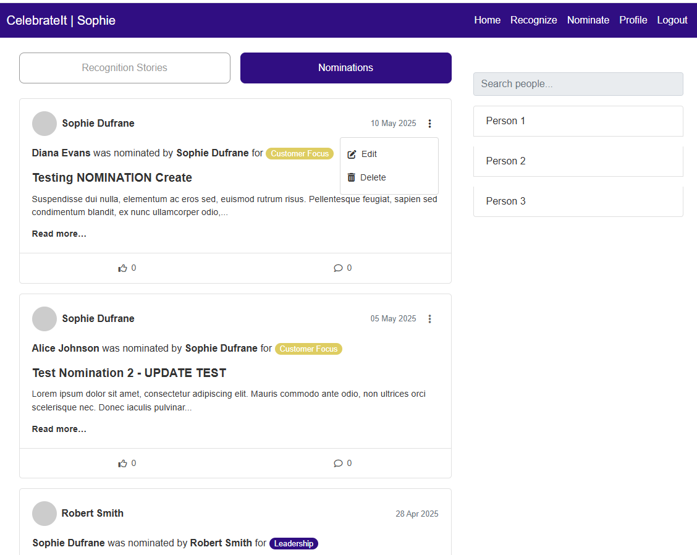

</details>

<details>
<summary> 6/ Edit Nomination – Successful message </summary>

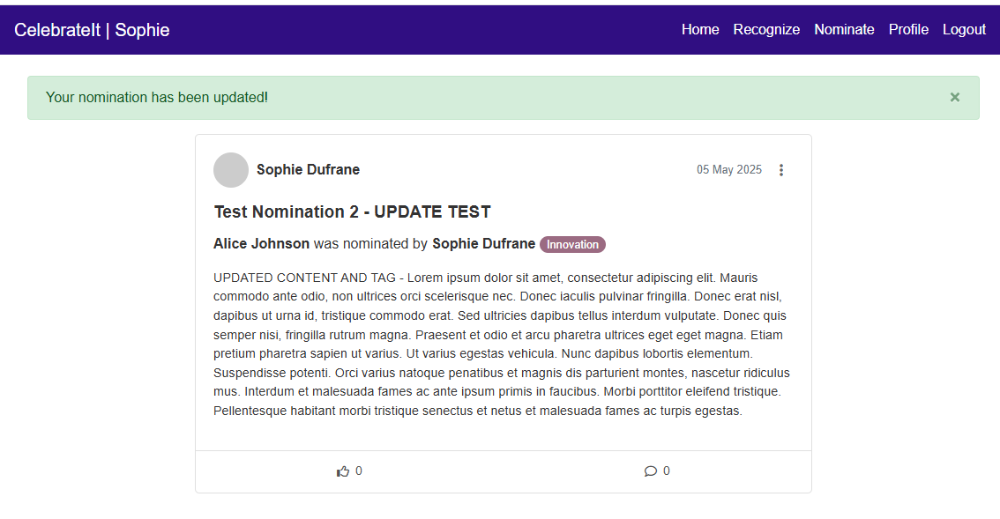

</details>

<details>
<summary> 7/ Delete Nomination - Confirmation prompt </summary>

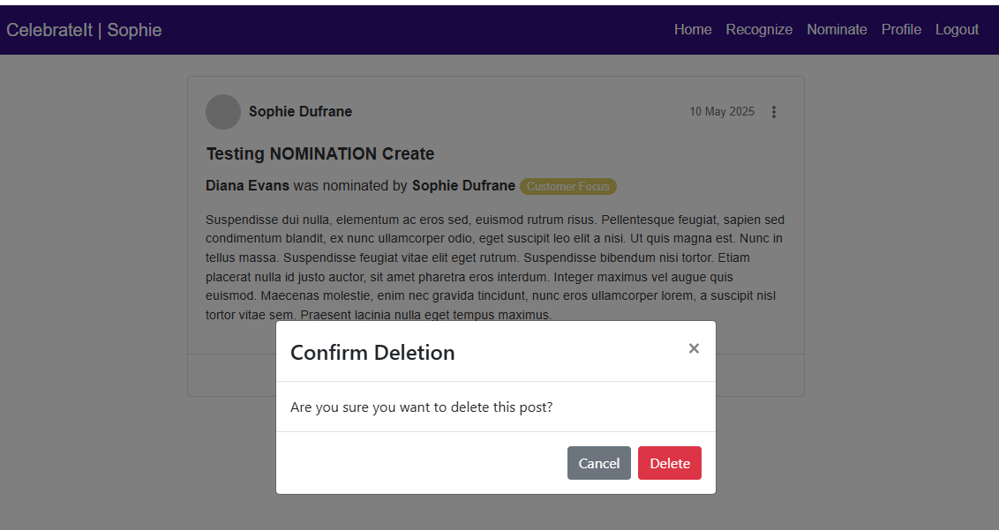

</details>

<details>
<summary> 8/ Delete Nomination > Successful message </summary>

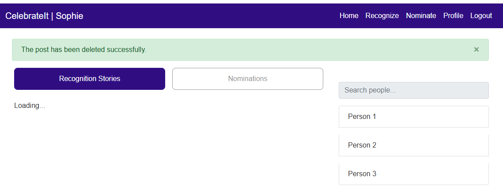

</details>

#### **Engaging with People & Posts**

| **Priority** | **User Story**         | **Page(s)**     | **Test Scenario / Action**            | **Expected Result**                                   | Actual | **Screenshot** |
| ------------ | ---------------------- | --------------- | ------------------------------------- | ----------------------------------------------------- | ------ | -------------- |
| Must Have    | Comment on Recognition | Detail Page     | Submit valid comment                  | Comment appears below post                            |        | 1              |
| Should Have  | Like a Recognition     | Feed / Detail   | Click like and unlike                 | Count updates and button toggles correctly            |        | 2 - 3          |
| Should Have  | Edit/Delete My Comment | Detail Page     | Click edit or delete on owned comment | Comment updates or disappears as expected             |        |                |
| Should Have  | Search for Colleagues  | Feed Search Bar | Type partial name                     | Matching users show with avatar + \"Nominate\" button |        |                |

<details>
<summary> 1/ Comment on Recognition </summary>


</details>

<details>
<summary> 2/ Like/Unlike on Recognition from the feed </summary>


</details>

<details>
<summary> 3/ Like/Unlike on Recognition from the detail page </summary>


</details>

#### **Managing My Profile & Network**

| **Priority** | **User Story**       | **Page(s)**            | **Test Scenario / Action**                          | **Expected Result**                           | Actual | **Screenshot** |
| ------------ | -------------------- | ---------------------- | --------------------------------------------------- | --------------------------------------------- | ------ | -------------- |
| Should Have  | Edit My Profile      | Profile Edit Page      | Change avatar or bio and save                       | Profile updates and info reflects new data    |        |
| Must Have    | View Public Profiles | Feed / Detail > Author | Click username/avatar of another user               | Public profile loads with bio + list of posts |        |
| Could Have   | View My Own Posts    | My Profile Page        | Visit profile and review recognitions + nominations | All user-created posts appear with preview    |        |

### 6.3 Validators

- **CSS - HTML**

- **JavaScript**

- **Python**

- **Lighthouse Performance & Best Practices Testing**

### 6.4 Bugs and Fixes

Profile Avatar Not Rendering:

- **Bug**: User avatars were not displaying in PostCards, NominationCards, or the profile header.
- **Cause**: The serializer output did not include the `profile_image` field, and the frontend components were not prepared to receive it.
- **Fix**: Added `profile_image` to the relevant serializers (Posts, Nominations, Profiles) and updated frontend components (`PostHeader`, `RecognitionCard`, `NominationCard`) to fetch and display the image.

Auth State Not Syncing After Login/Logout:

- **Bug**: After logging in or out, the UI would occasionally show outdated user info or delay updates in the navbar and post ownership checks.
- **Cause**: The token handling logic didn’t consistently clean up or refresh the current user state across sessions.
- **Fix**: Improved the token timestamp logic (`removeTokenTimestamp`) and refined how the `CurrentUserContext` handles state during login/logout. The app now reliably reflects auth state throughout all pages.

Create Nomination – Dropdown Requires Double Click:

- **Bug**: In the nominee search field, clicking a user's name doesn't collapse the dropdown unless clicked twice.
- **Status**: Still unresolved.
- **Observation**:
- **Planned Fix**:

---

## 7. Deployment

This project was deployed as a **fullstack app** using **Heroku**, serving both the Django API and React frontend from a single Heroku app. The backend was deployed first, followed by the frontend build.

The live link can be found here: [CelebrateIt](https://celebrateit-866641373084.herokuapp.com/)

### 7.1 Backend Deployment (Initial Phase)

##### Tech Stack

- Django REST Framework
- PostgreSQL (Heroku Postgres)
- Cloudinary (media hosting)

##### Steps:

1. **Set up PostgreSQL and Connect Heroku**

   - Create a Heroku app and attach a PostgreSQL database.
   - In Heroku Settings > Config Vars, add:

     - `DATABASE_URL` → provided by Heroku
     - `SECRET_KEY`, `CLOUDINARY_URL`, `ALLOWED_HOSTS`, `CLIENT_ORIGIN`

   - Install required packages:

   ```bash
   pip install dj_database_url psycopg2 gunicorn 'django-cors-headers<4.6'
   pip freeze > requirements.txt
   ```

2. **Database Configuration in `settings.py`**

   - Add this at the top:

   ```python
   import dj_database_url
   import json
   ```

   - Replace `DATABASES` block:

   ```python
   if 'DEV' in os.environ:
         DATABASES = {
            'default': {
               'ENGINE': 'django.db.backends.sqlite3',
               'NAME': BASE_DIR / 'db.sqlite3',
            }
         }
   else:
         DATABASES = {
            'default': dj_database_url.parse(os.environ.get("DATABASE_URL"))
         }
   ```

   - Update `ALLOWED_HOSTS`:

   ```python
   ALLOWED_HOSTS = json.loads(
         os.environ.get("ALLOWED_HOSTS", '["localhost", "127.0.0.1"]')
   )
   ```

3. **JWT Authentication and Permissions**

   - Add to `settings.py`:

   ```python
   REST_USE_JWT = True
   JWT_AUTH_COOKIE = 'my-app-auth'
   JWT_AUTH_REFRESH_COOKIE = 'my-refresh-token'
   JWT_AUTH_SAMESITE = 'None'
   JWT_AUTH_SECURE = True
   ```

   - Add these apps to `INSTALLED_APPS`:

   ```python
   'dj_rest_auth',
   'dj_rest_auth.registration',
   'allauth',
   'allauth.account',
   'corsheaders',
   ```

   - And middleware:

   ```python
   'corsheaders.middleware.CorsMiddleware',
   ```

   - Set CORS:

   ```python
   CORS_ALLOWED_ORIGINS = [
         origin for origin in [
            os.environ.get('CLIENT_ORIGIN'),
            os.environ.get('CLIENT_ORIGIN_DEV'),
         ] if origin
   ]
   CORS_ALLOW_CREDENTIALS = True
   ```

4. **Prepare for Deployment**

   - Create `Procfile`:

   ```text
   release: python manage.py makemigrations && python manage.py migrate
   web: gunicorn celebrateit_api.wsgi
   ```

   - Create `runtime.txt`:

   ```text
   python-3.10.11
   ```

   - In `settings.py`, replace hardcoded secret:

   ```python
   SECRET_KEY = os.getenv('SECRET_KEY')
   ```

5. **Database Setup**

   - Run in terminal:

   ```bash
   python manage.py makemigrations
   python manage.py migrate
   python manage.py createsuperuser
   ```

6. **Initial Deploy to Heroku**

   - Push to GitHub.
   - In Heroku > Deploy tab, connect your repo.
   - Click **Deploy Branch**.

The backend should now be live and ready to serve the frontend.

### 7.2 Frontend Deployment (Static Build Integration)

##### Tech Stack

- React
- WhiteNoise (for serving static files via Django)

1. **Install & configure WhiteNoise**

   ```bash
   pip install whitenoise==6.4.0
   pip freeze > requirements.txt
   ```

In `settings.py`:

- Add to `MIDDLEWARE`:

```python
'whitenoise.middleware.WhiteNoiseMiddleware',
```

- Ensure this order in `INSTALLED_APPS`:

```python
'cloudinary_storage',
'django.contrib.staticfiles',
'cloudinary',
```

- Add:

```python
STATIC_ROOT = BASE_DIR / 'staticfiles'
WHITENOISE_ROOT = BASE_DIR / 'staticfiles_build' / 'build'
```

2. **Build & move React app**

   - From `celebrateit_frontend/`:

   ```bash
   npm run build
   ```

   - From root project folder:

   ```bash
   rm -rf staticfiles_build/build
   mv celebrateit_frontend/build staticfiles_build/
   ```

3. **Update URLs and Axios**

   - In `urls.py`:

   ```python
   from django.views.generic import TemplateView

   urlpatterns = [
      path('', TemplateView.as_view(template_name='index.html')),
      path('api/', include('your_app.urls')),
   ]

   handler404 = TemplateView.as_view(template_name='index.html')
   ```

   - In `axiosDefaults.js`:

   ```js
   axios.defaults.baseURL = "/api";
   ```

   - In `package.json`:

   ```json
   "proxy": "http://localhost:8000"
   ```

4. **Runtime & Requirements**

   - Create `runtime.txt` in the root:

   ```
   python-3.10.11
   ```

   - Ensure `psycopg2` is in requirements:

   ```
   psycopg2==2.9.9
   ```

### Heroku Config Vars (Final Fullstack)

| Key                     | Value                            |
| ----------------------- | -------------------------------- |
| `ALLOWED_HOSTS`         | `["your-app.herokuapp.com"]`     |
| `CLIENT_ORIGIN`         | `https://your-app.herokuapp.com` |
| `DATABASE_URL`          | postgresql Provided by CI        |
| `SECRET_KEY`            | Django secret                    |
| `CLOUDINARY_URL`        | From Cloudinary dashboard        |
| `DISABLE_COLLECTSTATIC` | `1` (optional during setup)      |

### Final Deployment Steps

1. Commit and push to GitHub:

   ```bash
   git add .
   git commit -m "Prepare fullstack app for Heroku deployment"
   git push
   ```

2. On Heroku → Deploy tab:

   - Select `main` branch
   - Click **Deploy Branch**

---

### Post-deployment Checks

- Visit `https://your-app.herokuapp.com/`
- Confirm React app loads and routes
- Confirm Django API at `/api/...`
- Test login, form submissions, image upload, etc.

### 7.3 Forking and Cloning

Forking the repository creates a copy of this project, allowing modifications without affecting the original code. Once the repository is forked, it can be cloned to a local machine for development.</br>
Follow these steps to fork, clone, and work on the project:

- **Fork the repository**

  - Go to the repository you want to fork on [GitHub](https://github.com/).
  - In the top-right corner of the page, click `Fork`.
  - Name the new forked repository, then click `Create Fork`.
  - This creates a copy of the repository under your own GitHub account.

- **Clone the forked repository**
  - In the forked repository on GitHub, above the list of files, click `Code`.
  - Copy the URL for the repository (either HTTPS or SSH).
  - Open a terminal (or Git Bash).
  - Type `git clone`, then paste the copied URL.
  - Press `Enter`.
  - Navigate to the newly cloned repository directory: `cd` and the repository name.

### 7.4 Security Considerations

- **Secrets and keys** were stored in environment variables and never committed to the repository.
- **.env** files were added to `.gitignore` to prevent leakage of credentials and config values.
- The application was deployed with `DEBUG = False` to ensure a secure production environment.
- Sensitive variables used include `SECRET_KEY`, `CLOUDINARY_URL`, and database credentials.
- CORS was restricted via `CLIENT_ORIGIN` and `CORS_ALLOW_CREDENTIALS` to allow only known origins.

These precautions were followed to prevent security vulnerabilities and meet best practices for cloud deployment.

---

## 8. Credit

### **Content & Resources**

### **Acknowledgements**
