# CelebrateIt

## Table of Contents

1. [Project Overview](#1-project-overview)

2. [User Experience (UX)](#2-user-experience-ux)

   - 2.1 [Strategy](#21-strategy)
   - 2.2 [Scope](#22-scope)
   - 2.3 [System Architecture](#23-system-architecture)
   - 2.4 [Skeleton](#24-skeleton)
   - 2.5 [Surface](#25-surface)

3. [Features](#3-features)

4. [Technologies Used](#4-technologies-used)

5. [Development](#5-development)

   - 5.1 [Project Planning](#51-project-planning)
   - 5.2 [Code Structure](#53-code-structure)

6. [Testing](#6-testing)

   - 6.1 [Back-End Application Testing](#61-back-end-application-testing)
   - 6.2 [Front-End Application Testing](#62-front-end-application-testing)
   - 6.3 [Bugs and Fixes](#63-bugs-and-fixes)

7. [Deployment & Setup](#7-deployment-and-setup)

   - 7.1 [Backend Deployment](#71-backend-deployment)
   - 7.2 [Local Setup](#72-local-setup)

8. [Credits](#8-credits)

---

## 1. Project Overview

### Brief Description

CelebrateIt is a mock employee recognition platform inspired by the solutions offered by [Workhuman](https://www.workhuman.com). It allows employees to share recognition stories, nominate colleagues for their achievements, and engage with content through likes and comments. By fostering a sense of appreciation and collaboration, CelebrateIt mirrors the functionality and purpose of modern social recognition platforms.

Built using Django REST for the backend and React for the frontend, this project serves as a learning and portfolio exercise, demonstrating full-stack development skills in designing a scalable, functional, and user-friendly web application.

### Target Audience

CelebrateIt is designed for:

- **Employees**: To feel valued and connected by sharing their achievements and recognizing contributions from their colleagues.

- **HR Teams**: To track and analyze recognition trends, fostering a more engaged workforce while identifying top performers and recognizing outstanding contributions.

- **Team Leaders and Managers**: To build a positive team culture by facilitating recognition and appreciation among their team.

- **Companies**: That wish to improve employee satisfaction and retention by integrating a sense of community into their workplace culture.

---

## 2. User Experience (UX)

### 2.1 Strategy

To plan the project development, I adopted an Agile methodology centered on user experience. By using user stories grouped into EPICs, the project is broken down into smaller, manageable pieces, ensuring a structured and user-focused approach.

#### **EPIC - Getting Started & Joining the Platform**

| **ID**                                                         | **Theme**                | **User Story**                                                                                                                  | **Prioritization** |
| -------------------------------------------------------------- | ------------------------ | ------------------------------------------------------------------------------------------------------------------------------- | ------------------ |
| [1](https://github.com/SophieDufrane/PP5-celebrateit/issues/1) | Account Registration     | New employees can create an account with basic credentials to join the CelebrateIt platform.                                    | _must have_        |
| [2](https://github.com/SophieDufrane/PP5-celebrateit/issues/2) | Login to Account         | Returning users can securely log into their existing profile to access all features.                                            | _must have_        |
| [3](https://github.com/SophieDufrane/PP5-celebrateit/issues/4) | Log out of Account       | Users can securely log out of their account to ensure their information remains protected when they are not using the platform. | _must have_        |
| [4](https://github.com/SophieDufrane/PP5-celebrateit/issues/5) | Navigation Menu          | Users can access the main navigation menu from anywhere in the app to move between sections easily.                             | _must have_        |
| [5](https://github.com/SophieDufrane/PP5-celebrateit/issues/6) | Conditional Menu Options | The menu adapts based on login status — showing login/signup when logged out, and profile/logout when logged in.                | _must have_        |

#### **EPIC - Exploring the Community**

| **ID**                                                          | **Theme**                                 | **User Story**                                                                                                   | **Prioritization** |
| --------------------------------------------------------------- | ----------------------------------------- | ---------------------------------------------------------------------------------------------------------------- | ------------------ |
| [1](https://github.com/SophieDufrane/PP5-celebrateit/issues/7)  | Discover the Latest Stories & Nominations | Users can browse the feed to see the most recent recognition stories and nominations shared across the platform. | _must have_        |
| [2](https://github.com/SophieDufrane/PP5-celebrateit/issues/8)  | Find People                               | Users can search for colleagues by name and filter them by department.                                           | _should have_      |
| [3](https://github.com/SophieDufrane/PP5-celebrateit/issues/10) | Filter Nominations                        | Users can filter nominations by tag to focus on specific values or behaviours being celebrated.                  | _should have_      |

#### **EPIC - Sharing Stories and Nominations.**

| **ID**                                                          | **Theme**                         | **User Story**                                                                                           | **Prioritization** |
| --------------------------------------------------------------- | --------------------------------- | -------------------------------------------------------------------------------------------------------- | ------------------ |
| [1](https://github.com/SophieDufrane/PP5-celebrateit/issues/11) | Create a Recognition Story        | Enable users to share inspiring stories about colleagues, teams, or moments worth celebrating.           | _must have_        |
| [2](https://github.com/SophieDufrane/PP5-celebrateit/issues/27) | Nominate a colleague              | Allow users to nominate colleagues or teams for their outstanding work and achievements.                 | _must have_        |
| [3](https://github.com/SophieDufrane/PP5-celebrateit/issues/12) | View My Own Stories & Nominations | Users can view all their content, including stories and nominations                                      | _should have_      |
| [4](https://github.com/SophieDufrane/PP5-celebrateit/issues/13) | Edit My Recognition Story         | Users can return to a story they’ve written and update or refine it as needed.                           | _should have_      |
| [5](https://github.com/SophieDufrane/PP5-celebrateit/issues/14) | Delete My Recognition Story       | Users can delete a story they previously shared if they no longer want it to be visible on the platform. | _should have_      |

#### **EPIC - Engaging with Stories & Nominations**

| **ID**                                                          | **Theme**                                     | **User Story**                                                                                             | **Prioritization** |
| --------------------------------------------------------------- | --------------------------------------------- | ---------------------------------------------------------------------------------------------------------- | ------------------ |
| [1](https://github.com/SophieDufrane/PP5-celebrateit/issues/15) | View Story & Nominations Details              | Any user can click into a story or a nomination to view it fully, including all details.                   | _must have_        |
| [2](https://github.com/SophieDufrane/PP5-celebrateit/issues/16) | Like a Story or Nomination                    | Logged-in users can show support by liking a story or a nomination they connect with.                      | _could have_       |
| [3](https://github.com/SophieDufrane/PP5-celebrateit/issues/17) | Comment on a Story or Nomination              | Users can join the conversation by commenting on recognition stories or nominations shared by others.      | _could have_       |
| [4](https://github.com/SophieDufrane/PP5-celebrateit/issues/18) | Edit or Delete My Comments                    | Users can update or remove comments they've written.                                                       | _could have_       |
| [5](https://github.com/SophieDufrane/PP5-celebrateit/issues/20) | Stories or Nominations from Followed Profiles | The feed can be filtered to show only stories and nominations shared by users or teams the person follows. | _could have_       |

#### **EPIC - Managing My Profile & Network**

| **ID**                                                          | **Theme**            | **User Story**                                                                                                              | **Prioritization** |
| --------------------------------------------------------------- | -------------------- | --------------------------------------------------------------------------------------------------------------------------- | ------------------ |
| [1](https://github.com/SophieDufrane/PP5-celebrateit/issues/21) | View Public Profiles | Users can view the public-facing profiles of other employees, including their presentation, department, and shared stories. | _must have_        |
| [2](https://github.com/SophieDufrane/PP5-celebrateit/issues/22) | Edit My Profile      | Logged-in users can edit their avatar, presentation, and department to personalize their presence on the platform.          | _must have_        |

#### **EPIC - Keeping the Experience Seamless**

| **ID**                                                          | **Theme**               | **User Story**                                                                                               | **Prioritization** |
| --------------------------------------------------------------- | ----------------------- | ------------------------------------------------------------------------------------------------------------ | ------------------ |
| [1](https://github.com/SophieDufrane/PP5-celebrateit/issues/24) | Stay Logged In          | The platform maintains the user’s session until they choose to log out, reducing unnecessary interruptions.  | _must have_        |
| [2](https://github.com/SophieDufrane/PP5-celebrateit/issues/25) | Smooth Page Navigation  | Users can move between pages without full reloads, for a fast and fluid experience.                          | _should have_      |
| [3](https://github.com/SophieDufrane/PP5-celebrateit/issues/26) | Endless Story Scrolling | Stories load automatically as users scroll, removing the need for pagination and keeping engagement flowing. | _could have_       |

---

### 2.2 Scope

This section outlines the features and functionalities planned for CelebrateIt, categorized using the **MoSCoW Prioritization Framework**. This framework identifies features as:

- **Must Have**: Essential features that are critical for the platform's core functionality > 56%

- **Should Have**: High-priority features that enhance the user experience but are not essential for the platform's operation. > 26%

- **Could Have**: Nice-to-have features that provide additional value but are not critical to the platform's success. > 17%

- **Won't Have**: Features explicitly excluded from the current scope.

#### Planned Features

| **Feature**                                   | **MoSCoW Prioritization** |
| --------------------------------------------- | ------------------------- |
| Account Registration                          | Must Have                 |
| Login to Account                              | Must Have                 |
| Log out of Account                            | Must Have                 |
| Navigation Menu                               | Must Have                 |
| Conditional Menu Options                      | Should Have               |
| Discover the Latest Stories & Nominations     | Must Have                 |
| Search Stories, Nominations & People          | Should Have               |
| Browse Departments                            | Could Have                |
| Create a Recognition Story                    | Must Have                 |
| Create a Nomination                           | Must Have                 |
| View My Own Stories & Nominations             | Must Have                 |
| Edit My Story & Nomination                    | Should Have               |
| Delete My Story                               | Should Have               |
| View Story & Nominations Details              | Must Have                 |
| Like a Story or Nomination                    | Should Have               |
| Comment on a Story or Nomination              | Should Have               |
| Edit or Delete My Comments                    | Could Have                |
| Stories or Nominations from Followed Profiles | Could Have                |
| View Public Profiles                          | Should Have               |
| Edit My Profile                               | Should Have               |
| Stay Logged In                                | Must Have                 |
| Smooth Page Navigation                        | Should Have               |
| Endless Story Scrolling                       | Could Have                |

---

### 2.3 System Architecture

CelebrateIt is structured with a focus on separation of concerns. While the frontend handles presentation and user interactions, the backend provides a modular, scalable API to support those features.

- Built with Django REST Framework
- Divided into apps per domain: posts, nominations, profiles, etc.
- Modular, permission-based views and serializers
- Shared models like comments and likes allow interactions across apps

### Entity Relationship Diagram (ERD)

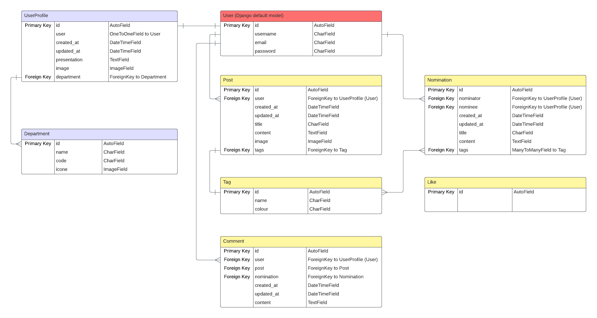

#### Flowchart for User Navigation

This section provides a visual representation of the user navigation flow within CelebrateIt. The flowchart captures how users interact with the platform, including key actions such as logging in, browsing stories, creating recognition posts, and navigating between profile pages.

---

### 2.4 Skeleton

#### Wireframes for Key Screens or Pages

The following wireframes outline the structure and layout of the main screens in CelebrateIt:

- **Secure Authentication**

  - Employees register, sign in and out securely using **Django Allauth**.

    

      
Landing Page

      
    

- **Secure Authentication**
- **Secure Authentication**
- **Secure Authentication**
- **Secure Authentication**

---

### 2.5 Surface

#### Typography & Colour Scheme

CelebrateIt builds on the visual identity of the previous Rewards Platform (PP4 - RedeemIt), maintaining a clean, user-friendly interface with a more social and collaborative tone.

The colour palette echoes tech industry trends while adding warmth to reflect human connection in the workplace. Fonts were chosen for readability and a modern feel.

#### Colour Palette

| **Colour** | **Name**         |
| ---------- | ---------------- |
| `#300E82`  | Persian Indigo   |
| `#586BBE`  | Savoy Blue       |
| `#9B6B82`  | Mountbatten Pink |
| `#DECD62`  | Citron           |
| `#484848`  | Davy's Grey      |

  
Click to view inspiration from Workhuman

  

  
Click to view trend reference

  

### Typography

- **Primary Font**: _Poppins_ – main body text
- **Secondary Font**: _Quicksand_ – used for highlights and UI accents

---

## 3. Features

- List of features available in the app

- List of features lest to implement

---

## 4. Technologies Used

- List programming languages, frameworks, libraries, and tools used

- Mention any third-party APIs or integrations

---

## 5. Development

### 5.1 Project Planning

- Agile methodology, Kanban, or other approaches used

- Tools (e.g., Trello, Jira, GitHub Projects)

### 5.2 Code Structure

The project is divided into feature-based Django apps:

- `posts/` – Recognition stories and related logic
- `nominations/` – Peer nominations with required tag selection
- `profiles/` – User profile extensions with department links
- `likes/` and `comments/` – Shared interactions for both posts and nominations
- `tags/` – Used to categorize recognitions and nominations
- `department/` – Departments available for user filtering and classification

Each app follows the same structure: `models.py`, `serializers.py`, `views.py`, and `urls.py`. Common permissions are stored in the main `celebrateit_api/permissions.py`.

---

## 6. Testing

### 6.1 Back-End Application Testing

The following tests were conducted manually to verify the functionality, permissions, and expected behavior of the back-end API endpoints. All tests were performed using the Django REST Framework browsable API interface through the browser.

Each section below corresponds to a model and includes the tested endpoint, HTTP method, required authentication, expected behavior, actual results, and screenshots where relevant.

#### **User Profiles**

| Endpoint                           | Action                     | Method | Auth | Expected                                         | Actual | Screenshot |
| ---------------------------------- | -------------------------- | ------ | ---- | ------------------------------------------------ | ------ | ---------- |
| `/user-profiles/`                  | List all user profiles     | GET    | ❌   | HTTP 200 OK                                      | ✅     | 1          |
| `/user-profiles/10/`               | View profile detail        | GET    | ❌   | HTTP 200 OK                                      | ✅     | 2          |
| `/user-profiles/9/`                | Update profile (owner)     | PUT    | ✅   | HTTP 200 OK / Profile updated                    | ✅     | 3          |
| `/user-profiles/10/`               | Update profile (not owner) | PUT    | ✅   | HTTP 403 Forbidden / Profile should be read-only | ✅     | 4          |
| `/user-profiles/?department=SALES` | Filter by department       | GET    | ❌   | HTTP 200 OK / Only SALES users                   | ✅     | 5          |
| `/user-profiles/?search=raymond`   | Search by name             | GET    | ❌   | HTTP 200 OK / Only Profiles with \"raymond\"     | ✅     | 6          |

 1/ List all user profiles 

 2/ View profile detail 

 3/ Update profile (owner) 

 4/ Update profile (not owner) 

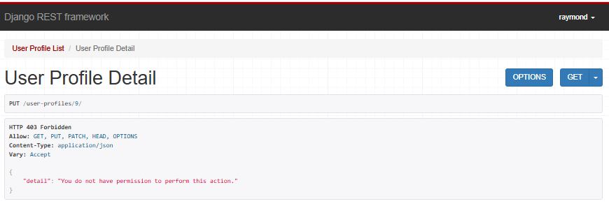

 5/ Filter by department 

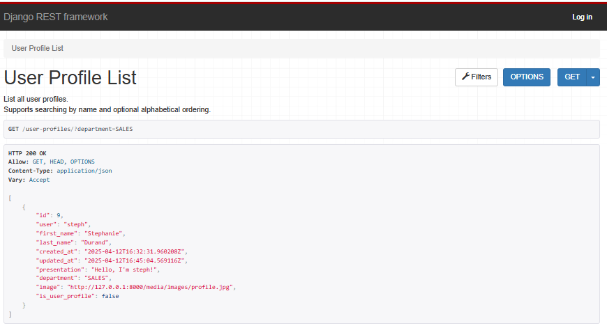

 6/ Search by name 

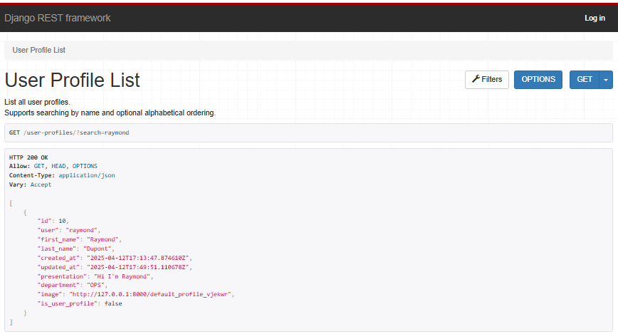

#### **Posts**

| Endpoint                   | Action                    | Method | Auth | Expected                                                  | Actual | Screenshot |
| -------------------------- | ------------------------- | ------ | ---- | --------------------------------------------------------- | ------ | ---------- |
| `/posts/`                  | List all the posts        | GET    | ❌   | HTTP 200 OK                                               | ✅     | 1          |
| `/posts/4/`                | View a post detail        | GET    | ❌   | HTTP 200 OK                                               | ✅     | 2          |
| `/posts/`                  | Create a post             | POST   | ✅   | HTTP 201 Created                                          | ✅     | 3          |
| `/posts/5/`                | Update a post (owner)     | PUT    | ✅   | HTTP 200 OK / Post updated successfully                   | ✅     | 4          |
| `/posts/1/`                | Update a post (not owner) | GET    | ✅   | HTTP 403 Forbidden / Post should be read-only             | ✅     | 5          |
| `/posts/2/`                | Delete a post (owner)     | DELETE | ✅   | HTTP 204 No Content                                       | ✅     | 6          |
| `/posts/1/`                | Delete a post (not owner) | DELETE | ✅   | HTTP 403 Forbidden / Post should be read-only             | ✅     | 7          |
| `/posts/?search=raymond`   | Search by name            | GET    | ❌   | HTTP 200 OK / Only posts with \"raymond\"                 | ✅     | 8          |
| `/posts/?department=SALES` | Filter by department      | GET    | ❌   | HTTP 200 OK / Only posts from users in department "SALES" | ✅     | 9          |

 1/ List all the posts 

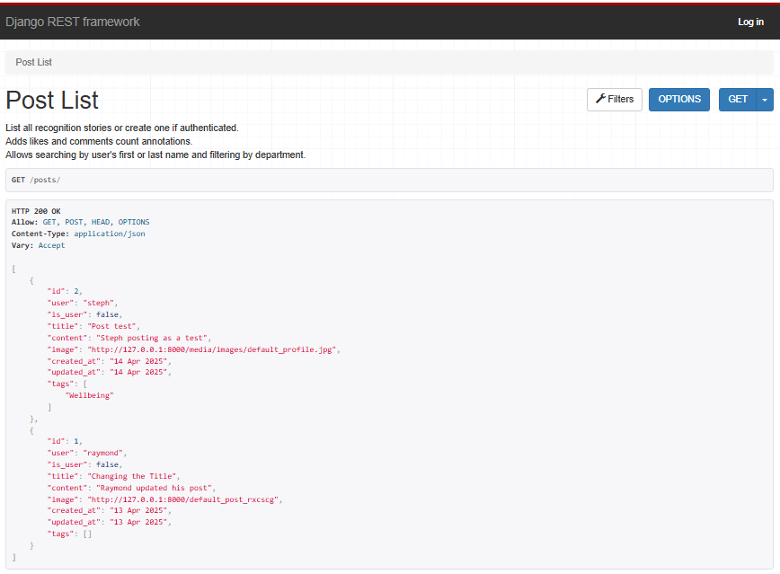

 2/ View a post detail 

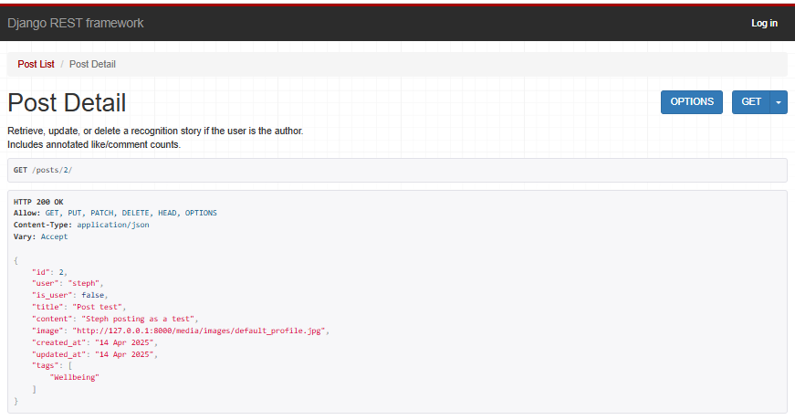

 3/ Create a post 

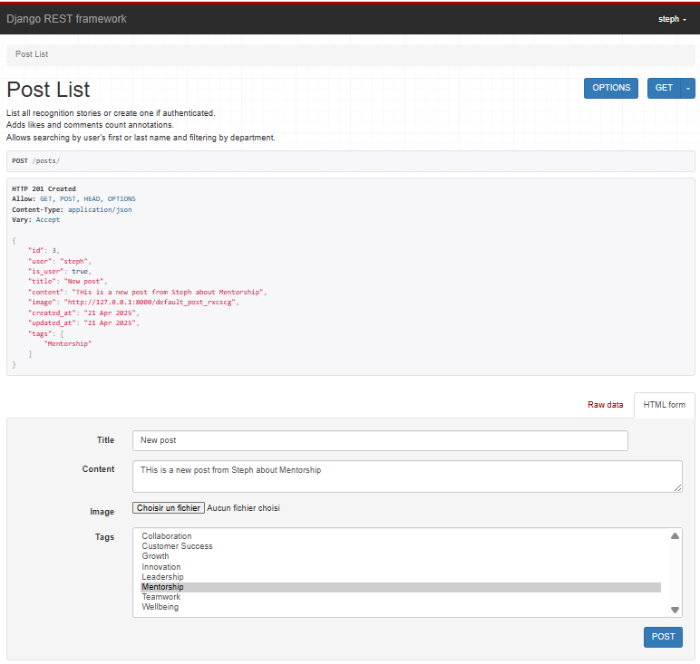

 4/ Update a post (owner) 

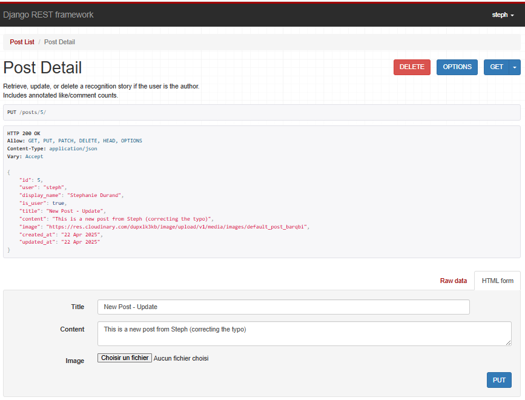

 5/ Update a post (not owner) 

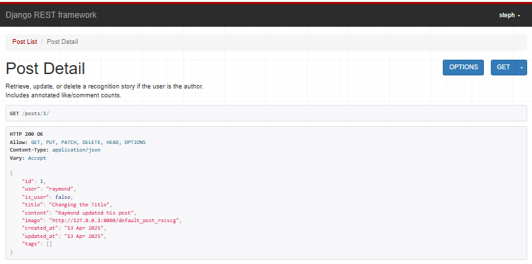

 6/ Delete a post (owner) 

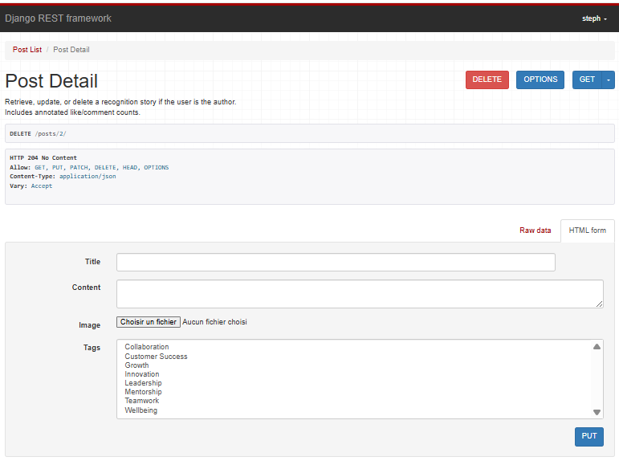

 7/ Delete a post (not owner) 

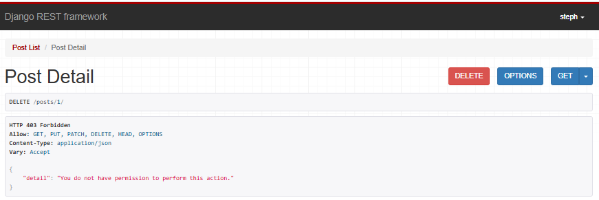

 8/ Search by name 

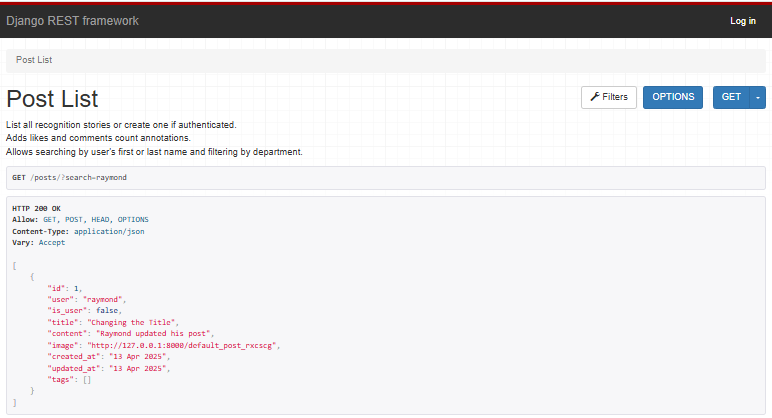

 9/ Search by department 

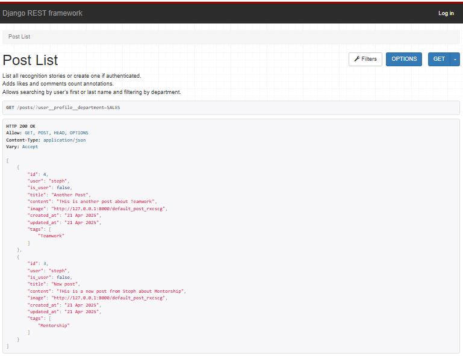

#### **Nominations**

| Endpoint                                             | Action                           | Method | Auth | Expected                                                       | Actual | Screenshot |
| ---------------------------------------------------- | -------------------------------- | ------ | ---- | -------------------------------------------------------------- | ------ | ---------- |
| `/nominations/`                                      | List all the nominations         | GET    | ❌   | HTTP 200 OK                                                    | ✅     | 1          |
| `/nominations/1/`                                    | View a nomination detail         | GET    | ❌   | HTTP 200 OK                                                    | ✅     | 2          |
| `/nominations/`                                      | Create a nomination              | POST   | ✅   | HTTP 201 Created                                               | ✅     | 3          |
| `/nominations/7/`                                    | Update a nomination (owner)      | PUT    | ✅   | HTTP 200 OK / Nomination updated successfully                  | ✅     | 4          |
| `/nominations/1/`                                    | Update a nomination (not owner)  | GET    | ✅   | HTTP 403 Forbidden / Nomination should be read-only            | ✅     | 5          |
| `/nominations/7/`                                    | Delete a nomination (owner)      | DELETE | ✅   | HTTP 204 No Content                                            | ✅     | 6          |
| `/nominations/1/`                                    | Delete a nomination (not owner)  | DELETE | ✅   | HTTP 403 Forbidden / Nomination should be read-only            | ✅     | 7          |
| `/nominations/?search=raymond`                       | Search by nominee/nominator      | GET    | ❌   | HTTP 200 OK / Only nominations involving "raymond"             | ✅     | 8          |
| `/nominations/?nominator__profile__department=SALES` | Filter by department (nominator) | GET    | ❌   | HTTP 200 OK / Only nominations from "SALES" nominator profiles | ✅     | 9          |
| `/nominations/?tag=3`                                | Filter by tag                    | GET    | ❌   | HTTP 200 OK / Only nominations with "Innovation" tag (ID=3)    | ✅     | 10         |
| `/nominations/?nominee=2`                            | Filter by nominee                | GET    | ❌   | HTTP 200 OK / Only nominee "steph" (ID=2)                      | ✅     | 11         |

 1/ List all the nominations 

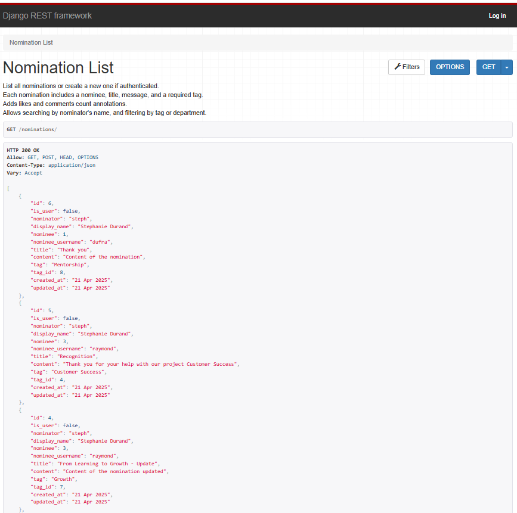

 2/ View a nomination detail 

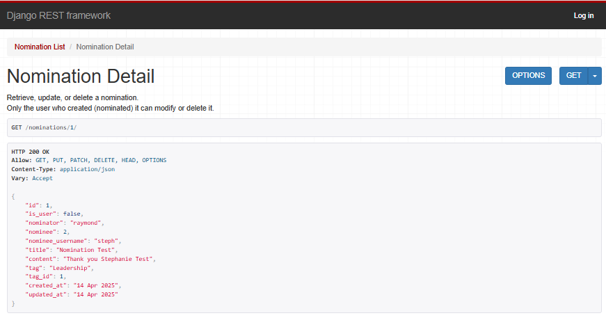

 3/ Create a nomination 

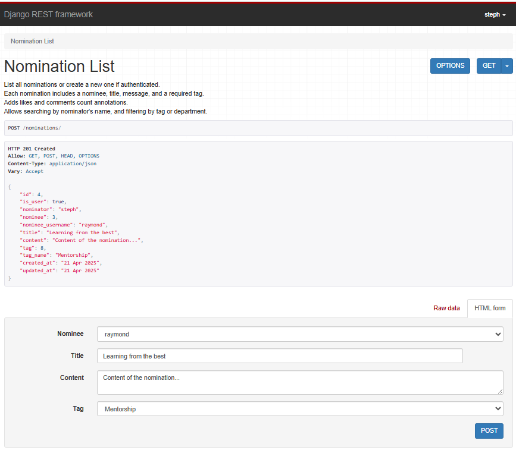

 4/ Update a nomination (owner) 

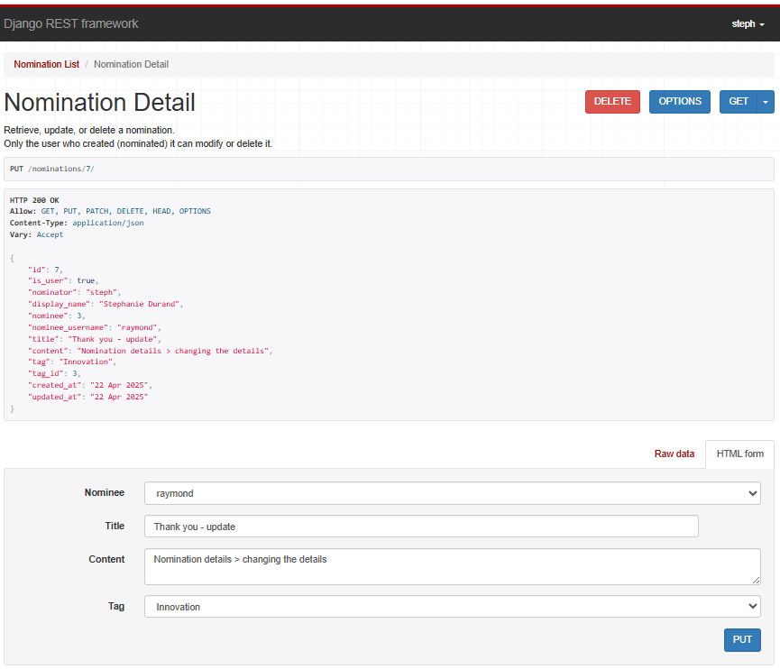

 5/ Update a nomination (not owner) 

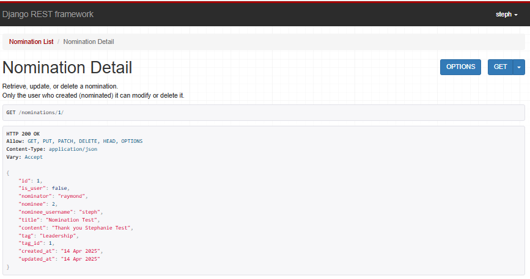

 6/ Delete a nomination (owner) 

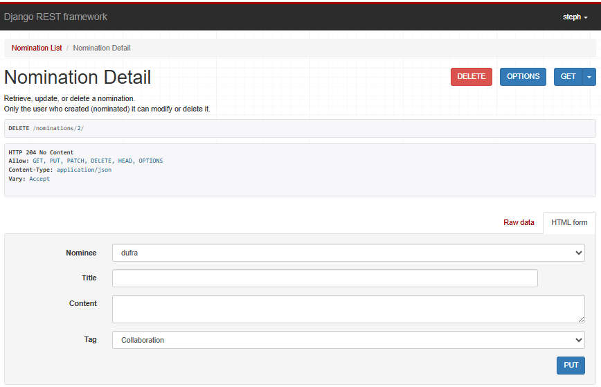

 7/ Delete a nomination (not owner) 

 8/ Search by nominee/nominator 

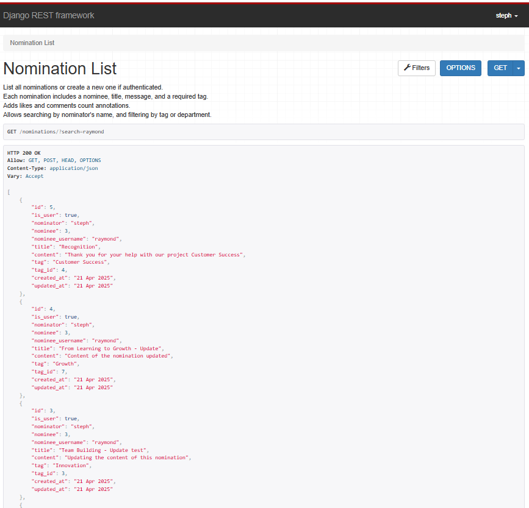

 9/ Filter by department (nominator) 

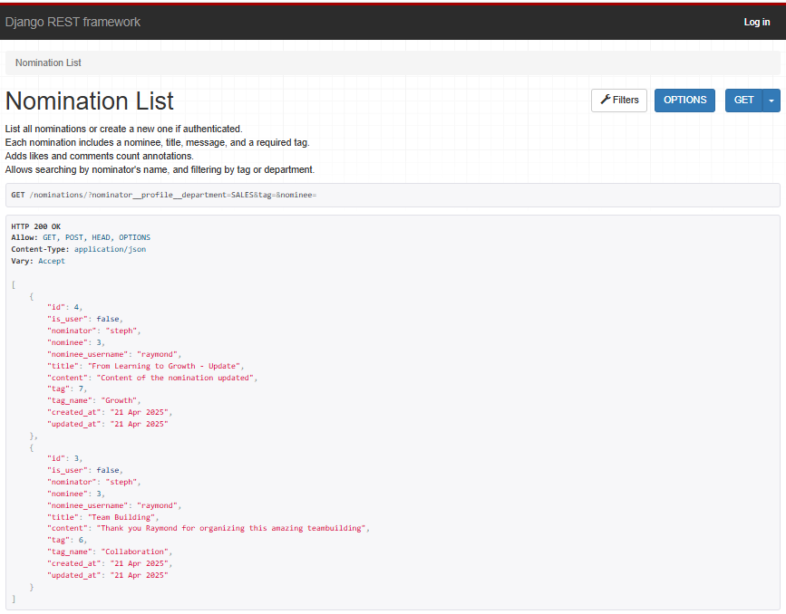

 10/ Filter by tag 

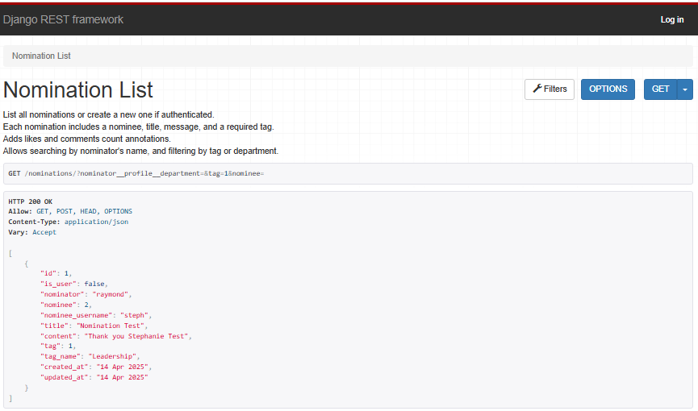

 11/ Filter by nominee 

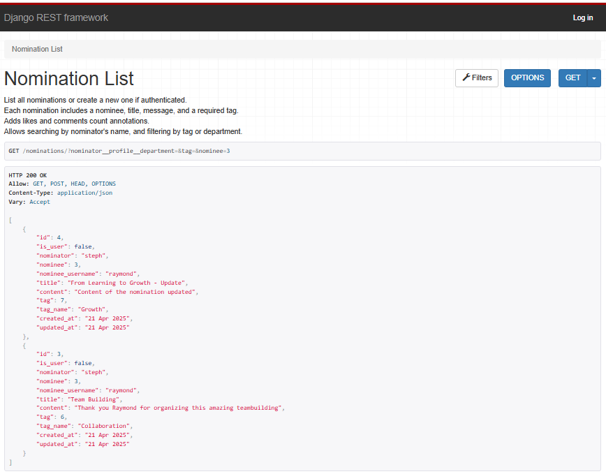

#### **Comments**

| Endpoint                  | Action                              | Method | Auth | Expected                                    | Actual | Screenshot |
| ------------------------- | ----------------------------------- | ------ | ---- | ------------------------------------------- | ------ | ---------- |
| `/comments/`              | List all the comments               | GET    | ❌   | HTTP 200 OK                                 | ✅     | 1          |
| `/comments/`              | Create a comment on post/nomination | POST   | ✅   | HTTP 201 Created                            | ✅     | 2          |
| `/comments/4/`            | Update a comment (owner)            | PUT    | ✅   | HTTP 200 OK / Comment updated successfully  | ✅     | 3          |
| `/comments/4/`            | Delete a comment (owner)            | DELETE | ✅   | HTTP 204 No Content                         | ✅     | 4          |
| `/comments/?post=4`       | Filter by post                      | GET    | ❌   | HTTP 200 OK / Only comments on post 4       | ✅     | 5          |
| `/comments/?nomination=3` | Filter by nomination                | GET    | ❌   | HTTP 200 OK / Only comments on nomination 3 | ✅     | 6          |

 1/ List all the comments 

 2/ Create a comment 

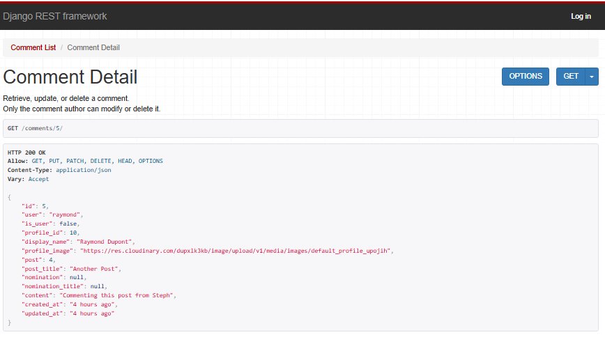

 3/ Update a comment (owner) 

 4/ Delete a comment (owner) 

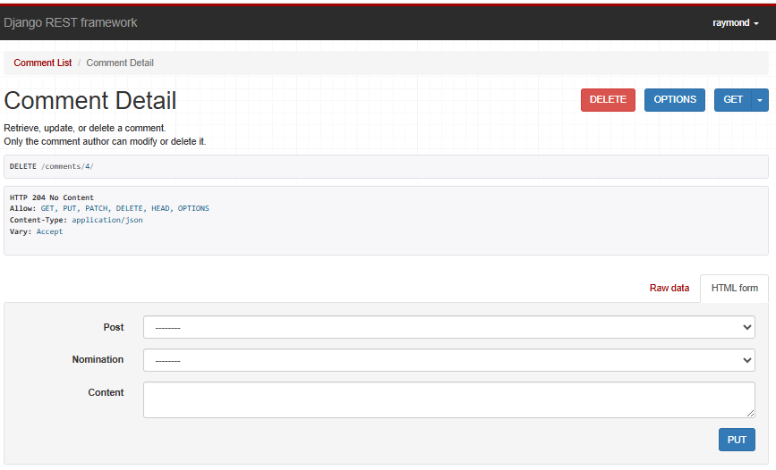

 5/ Filter by post 

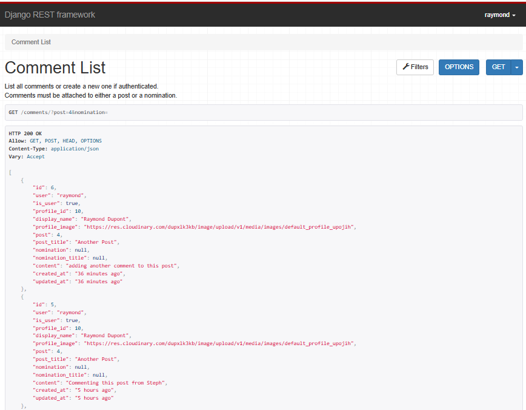

 6/ Filter by nomination 

#### **Likes**

| Endpoint    | Action                               | Method | Auth | Expected                               | Actual | Screenshot |
| ----------- | ------------------------------------ | ------ | ---- | -------------------------------------- | ------ | ---------- |
| `/likes/`   | Create a like on post/nomination     | POST   | ✅   | HTTP 201 Created                       | ✅     | 1          |
| `/likes/`   | Invalid: like both post & nomination | POST   | ✅   | HTTP 400 Bad Request / Can’t like both | ✅     | 2          |
| `/likes/`   | Invalid: like same thing twice       | POST   | ✅   | HTTP 400 Bad Request / Already liked   | ✅     | 3          |
| `/likes/5/` | Delete a like (owner)                | DELETE | ✅   | HTTP 204 No Content                    | ✅     | 4          |

 1/ Create a like on post/nomination 

 2/ Invalid: like both post & nomination 

 3/ Invalid: like same thing twice 

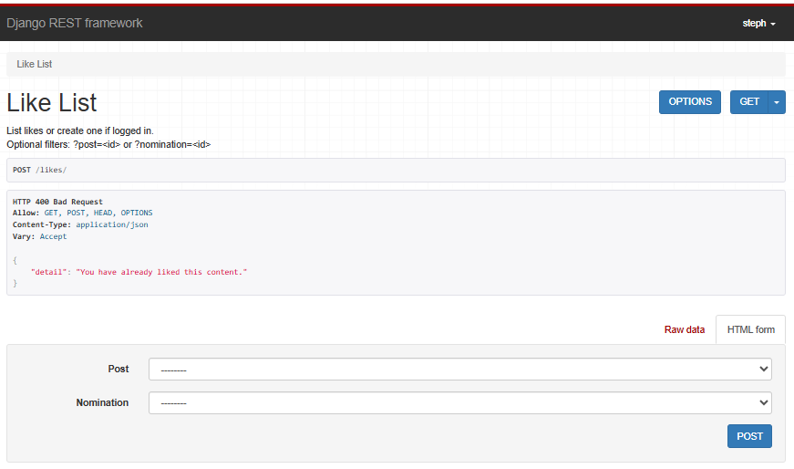

 4/ Delete a like (owner) 

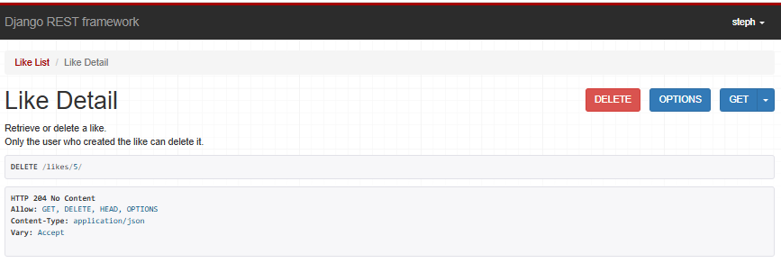

#### **Departments (via Profiles, Posts, Nominations)**

| Endpoint                                           | Action                                      | Method | Auth | Expected                                                 | Actual | Screenshot |
| -------------------------------------------------- | ------------------------------------------- | ------ | ---- | -------------------------------------------------------- | ------ | ---------- |
| `/user-profiles/`                                  | List profiles with department field visible | GET    | ❌   | HTTP 200 OK / Department value shown per profile         | ✅     | 1          |
| `/user-profiles/10`                                | Profile detail with department field        | GET    | ❌   | HTTP 200 OK / Department is correct for the user         | ✅     | 2          |
| `/posts/?user__profile__department=OPS`            | Filter posts by user department             | GET    | ❌   | HTTP 200 OK / Only posts from users in Operation         | ✅     | 3          |
| `/nominations/?nominator__profile__department=OPS` | Filter nominations by nominator department  | GET    | ❌   | HTTP 200 OK / Only nominations from Operation nominators | ✅     | 4          |

 1/ List profiles with department field visible 

 2/ Profile detail with department field 

 3/ Filter posts by user department 

 4/ Filter nominations by nominator department 

### 6.2 Front-End Application Testing

- Manual testing

- Automated testing

### 6.3 Validators

- **CSS - HTML**

- **JavaScript**

- **Python**

- **Lighthouse Performance & Best Practices Testing**

### 6.3 Bugs and Fixes

- List known bugs

- Unresolved issues

---

## 7. Deployment

### 7.1 Heroku

The site was deployed successfully to [Heroku]() following the steps below:

1. In _Gitpod_, create a list of dependencies in `requirements.txt` file:
   - Run `pip3 freeze > requirements.txt` in the terminal.
   - Create _Procfile_
2. In _Heroku_ account, create the new App:
   - Select `New` and `Create a new app`.
   - Name the App (name must be unique) and choose a region: `Europe`
   - Click `Create App`.
3. In the new App page, access to the `Settings` section.
4. In `Config Var` add :
   - `DATABASE_URL` and its value.
   - `SECRET_KEY` and its value.
   - `CLOUDINARY_URL` and its value.
   - Click `Add`.
5. Access to the `Deploy` section.
6. Select the deployment method:
   - Select `GitHub`
   - Search for the repository by taping the name in the search barre.
   - Click on `Connect`
7. Click `Deploy Branch`.
8. Once App deployed, the message _Your app was successfully deployed._

The live link can be found here: [CelebrateIt]()

### 7.1 Forking and Cloning

Forking the repository creates a copy of this project, allowing modifications without affecting the original code. Once the repository is forked, it can be cloned to a local machine for development. 
Follow these steps to fork, clone, and work on the project:

- **Fork the repository**

  - Go to the repository you want to fork on [GitHub](https://github.com/).
  - In the top-right corner of the page, click `Fork`.
  - Name the new forked repository, then click `Create Fork`.
  - This creates a copy of the repository under your own GitHub account.

- **Clone the forked repository**
  - In the forked repository on GitHub, above the list of files, click `Code`.
  - Copy the URL for the repository (either HTTPS or SSH).
  - Open a terminal (or Git Bash).
  - Type `git clone`, then paste the copied URL.
  - Press `Enter`.
  - Navigate to the newly cloned repository directory: `cd` and the repository name.

## 8. Credit

### **Content & Resources**

### **Acknowledgements**
